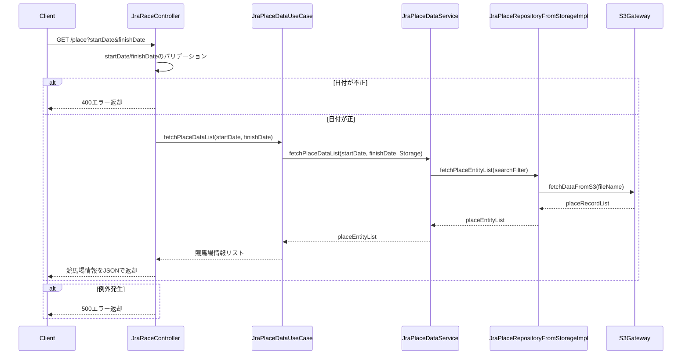

# getPlaceDataList シーケンス図（JRA）

```mermaid
sequenceDiagram
    participant Client
    participant JraRaceController
    participant JraPlaceDataUseCase
    participant JraPlaceDataService
    participant JraPlaceRepositoryFromStorageImpl
    participant S3Gateway

    Client->>JraRaceController: GET /place?startDate&finishDate
    JraRaceController->>JraRaceController: startDate/finishDateのバリデーション
    alt 日付が不正
        JraRaceController-->>Client: 400エラー返却
    else 日付が正
        JraRaceController->>JraPlaceDataUseCase: fetchPlaceDataList(startDate, finishDate)
        JraPlaceDataUseCase->>JraPlaceDataService: fetchPlaceDataList(startDate, finishDate, Storage)
        JraPlaceDataService->>JraPlaceRepositoryFromStorageImpl: fetchPlaceEntityList(searchFilter)
        JraPlaceRepositoryFromStorageImpl->>S3Gateway: fetchDataFromS3(fileName)
        S3Gateway-->>JraPlaceRepositoryFromStorageImpl: placeRecordList
        JraPlaceRepositoryFromStorageImpl-->>JraPlaceDataService: placeEntityList
        JraPlaceDataService-->>JraPlaceDataUseCase: placeEntityList
        JraPlaceDataUseCase-->>JraRaceController: 競馬場情報リスト
        JraRaceController-->>Client: 競馬場情報をJSONで返却
    end
    alt 例外発生
        JraRaceController-->>Client: 500エラー返却
    end
```
