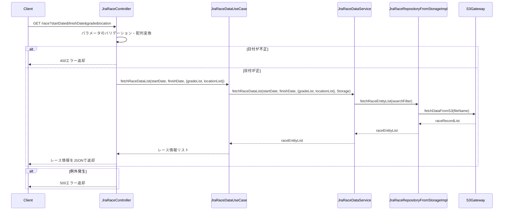

# getRaceDataList シーケンス図（JRA）

```mermaid
sequenceDiagram
    participant Client
    participant JraRaceController
    participant JraRaceDataUseCase
    participant JraRaceDataService
    participant JraRaceRepositoryFromStorageImpl
    participant S3Gateway

    Client->>JraRaceController: GET /race?startDate&finishDate&grade&location
    JraRaceController->>JraRaceController: パラメータのバリデーション・配列変換
    alt 日付が不正
        JraRaceController-->>Client: 400エラー返却
    else 日付が正
        JraRaceController->>JraRaceDataUseCase: fetchRaceDataList(startDate, finishDate, {gradeList, locationList})
        JraRaceDataUseCase->>JraRaceDataService: fetchRaceDataList(startDate, finishDate, {gradeList, locationList}, Storage)
        JraRaceDataService->>JraRaceRepositoryFromStorageImpl: fetchRaceEntityList(searchFilter)
        JraRaceRepositoryFromStorageImpl->>S3Gateway: fetchDataFromS3(fileName)
        S3Gateway-->>JraRaceRepositoryFromStorageImpl: raceRecordList
        JraRaceRepositoryFromStorageImpl-->>JraRaceDataService: raceEntityList
        JraRaceDataService-->>JraRaceDataUseCase: raceEntityList
        JraRaceDataUseCase-->>JraRaceController: レース情報リスト
        JraRaceController-->>Client: レース情報をJSONで返却
    end
    alt 例外発生
        JraRaceController-->>Client: 500エラー返却
    end
```
