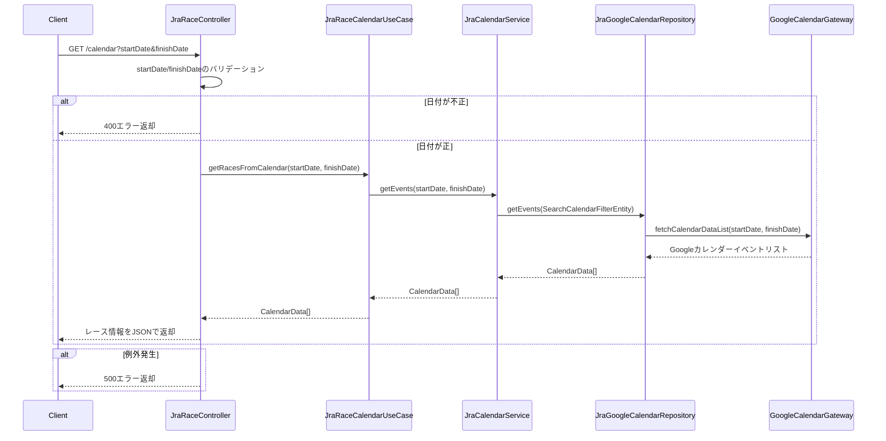

# getRacesFromCalendar シーケンス図（JRA）

```mermaid
sequenceDiagram
    participant Client
    participant JraRaceController
    participant JraRaceCalendarUseCase
    participant JraCalendarService
    participant JraGoogleCalendarRepository
    participant GoogleCalendarGateway

    Client->>JraRaceController: GET /calendar?startDate&finishDate
    JraRaceController->>JraRaceController: startDate/finishDateのバリデーション
    alt 日付が不正
        JraRaceController-->>Client: 400エラー返却
    else 日付が正
        JraRaceController->>JraRaceCalendarUseCase: getRacesFromCalendar(startDate, finishDate)
        JraRaceCalendarUseCase->>JraCalendarService: getEvents(startDate, finishDate)
        JraCalendarService->>JraGoogleCalendarRepository: getEvents(SearchCalendarFilterEntity)
        JraGoogleCalendarRepository->>GoogleCalendarGateway: fetchCalendarDataList(startDate, finishDate)
        GoogleCalendarGateway-->>JraGoogleCalendarRepository: Googleカレンダーイベントリスト
        JraGoogleCalendarRepository-->>JraCalendarService: CalendarData[]
        JraCalendarService-->>JraRaceCalendarUseCase: CalendarData[]
        JraRaceCalendarUseCase-->>JraRaceController: CalendarData[]
        JraRaceController-->>Client: レース情報をJSONで返却
    end
    alt 例外発生
        JraRaceController-->>Client: 500エラー返却
    end
```
