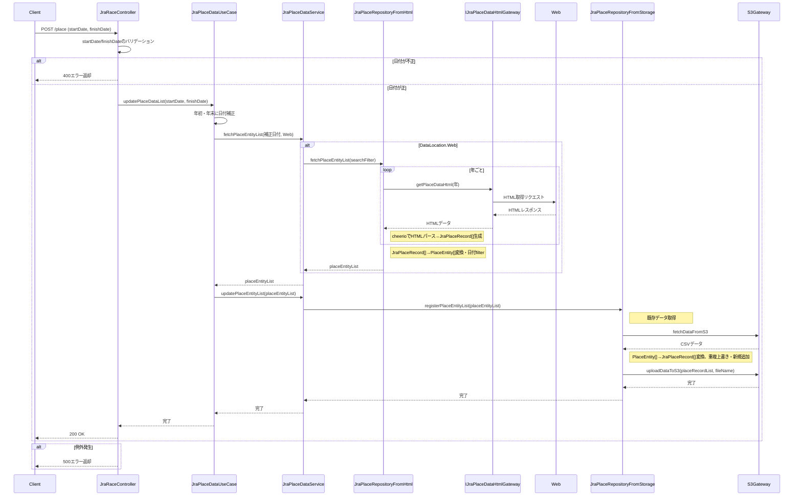

# updatePlaceDataList シーケンス図（JRA）

```mermaid
sequenceDiagram
    participant Client
    participant JraRaceController
    participant JraPlaceDataUseCase
    participant JraPlaceDataService
    participant JraPlaceRepositoryFromHtml
    participant IJraPlaceDataHtmlGateway
    participant Web
    participant JraPlaceRepositoryFromStorage
    participant S3Gateway

    Client->>JraRaceController: POST /place (startDate, finishDate)
    JraRaceController->>JraRaceController: startDate/finishDateのバリデーション
    alt 日付が不正
        JraRaceController-->>Client: 400エラー返却
    else 日付が正
        JraRaceController->>JraPlaceDataUseCase: updatePlaceDataList(startDate, finishDate)
        JraPlaceDataUseCase->>JraPlaceDataUseCase: 年初・年末に日付補正
        JraPlaceDataUseCase->>JraPlaceDataService: fetchPlaceEntityList(補正日付, Web)
        alt DataLocation.Web
            JraPlaceDataService->>JraPlaceRepositoryFromHtml: fetchPlaceEntityList(searchFilter)
            loop 年ごと
                JraPlaceRepositoryFromHtml->>IJraPlaceDataHtmlGateway: getPlaceDataHtml(年)
                IJraPlaceDataHtmlGateway->>Web: HTML取得リクエスト
                Web-->>IJraPlaceDataHtmlGateway: HTMLレスポンス
                IJraPlaceDataHtmlGateway-->>JraPlaceRepositoryFromHtml: HTMLデータ
                note right of JraPlaceRepositoryFromHtml: cheerioでHTMLパース→JraPlaceRecord[]生成
            end
            note right of JraPlaceRepositoryFromHtml: JraPlaceRecord[]→PlaceEntity[]変換・日付filter
            JraPlaceRepositoryFromHtml-->>JraPlaceDataService: placeEntityList
        end
        JraPlaceDataService-->>JraPlaceDataUseCase: placeEntityList
        JraPlaceDataUseCase->>JraPlaceDataService: updatePlaceEntityList(placeEntityList)
        JraPlaceDataService->>JraPlaceRepositoryFromStorage: registerPlaceEntityList(placeEntityList)
        note right of JraPlaceRepositoryFromStorage: 既存データ取得
        JraPlaceRepositoryFromStorage->>S3Gateway: fetchDataFromS3
        S3Gateway-->>JraPlaceRepositoryFromStorage: CSVデータ
        note right of JraPlaceRepositoryFromStorage: PlaceEntity[]→JraPlaceRecord[]変換、重複上書き・新規追加
        JraPlaceRepositoryFromStorage->>S3Gateway: uploadDataToS3(placeRecordList, fileName)
        S3Gateway-->>JraPlaceRepositoryFromStorage: 完了
        JraPlaceRepositoryFromStorage-->>JraPlaceDataService: 完了
        JraPlaceDataService-->>JraPlaceDataUseCase: 完了
        JraPlaceDataUseCase-->>JraRaceController: 完了
        JraRaceController-->>Client: 200 OK
    end
    alt 例外発生
        JraRaceController-->>Client: 500エラー返却
    end
```
