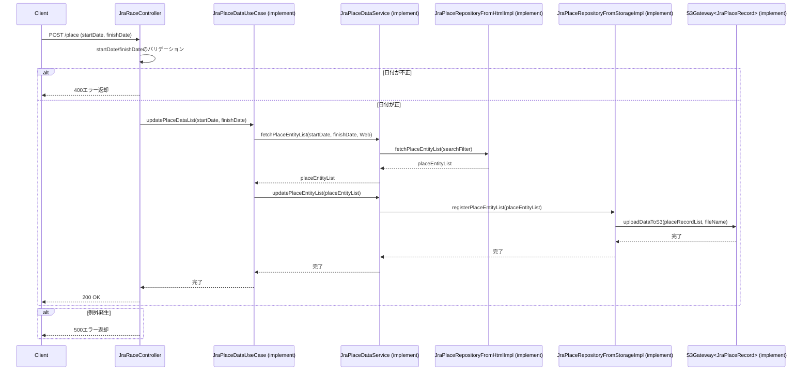

# updatePlaceDataList シーケンス図（JRA）

```mermaid
sequenceDiagram
    participant Client
    participant JraRaceController
    participant JraPlaceDataUseCase as JraPlaceDataUseCase (implement)
    participant JraPlaceDataService as JraPlaceDataService (implement)
    participant JraPlaceRepositoryFromHtmlImpl as JraPlaceRepositoryFromHtmlImpl (implement)
    participant JraPlaceRepositoryFromStorageImpl as JraPlaceRepositoryFromStorageImpl (implement)
    participant S3Gateway as S3Gateway<JraPlaceRecord> (implement)

    Client->>JraRaceController: POST /place (startDate, finishDate)
    JraRaceController->>JraRaceController: startDate/finishDateのバリデーション
    alt 日付が不正
        JraRaceController-->>Client: 400エラー返却
    else 日付が正
        JraRaceController->>JraPlaceDataUseCase: updatePlaceDataList(startDate, finishDate)
        JraPlaceDataUseCase->>JraPlaceDataService: fetchPlaceEntityList(startDate, finishDate, Web)
        JraPlaceDataService->>JraPlaceRepositoryFromHtmlImpl: fetchPlaceEntityList(searchFilter)
        JraPlaceRepositoryFromHtmlImpl-->>JraPlaceDataService: placeEntityList
        JraPlaceDataService-->>JraPlaceDataUseCase: placeEntityList
        JraPlaceDataUseCase->>JraPlaceDataService: updatePlaceEntityList(placeEntityList)
        JraPlaceDataService->>JraPlaceRepositoryFromStorageImpl: registerPlaceEntityList(placeEntityList)
        JraPlaceRepositoryFromStorageImpl->>S3Gateway: uploadDataToS3(placeRecordList, fileName)
        S3Gateway-->>JraPlaceRepositoryFromStorageImpl: 完了
        JraPlaceRepositoryFromStorageImpl-->>JraPlaceDataService: 完了
        JraPlaceDataService-->>JraPlaceDataUseCase: 完了
        JraPlaceDataUseCase-->>JraRaceController: 完了
        JraRaceController-->>Client: 200 OK
    end
    alt 例外発生
        JraRaceController-->>Client: 500エラー返却
    end
```
