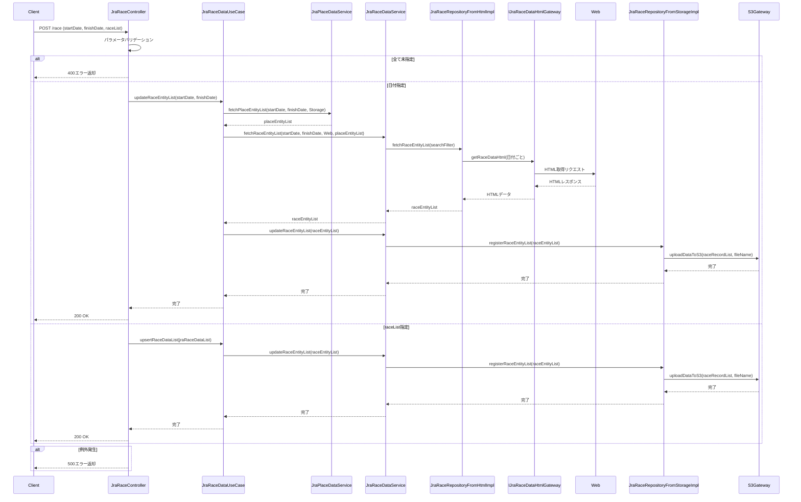

# updateRaceDataList シーケンス図（JRA）

```mermaid
sequenceDiagram
    participant Client
    participant JraRaceController
    participant JraRaceDataUseCase
    participant JraPlaceDataService
    participant JraRaceDataService
    participant JraRaceRepositoryFromHtmlImpl
    participant IJraRaceDataHtmlGateway
    participant Web
    participant JraRaceRepositoryFromStorageImpl
    participant S3Gateway

    Client->>JraRaceController: POST /race (startDate, finishDate, raceList)
    JraRaceController->>JraRaceController: パラメータバリデーション
    alt 全て未指定
        JraRaceController-->>Client: 400エラー返却
    else 日付指定
        JraRaceController->>JraRaceDataUseCase: updateRaceEntityList(startDate, finishDate)
        JraRaceDataUseCase->>JraPlaceDataService: fetchPlaceEntityList(startDate, finishDate, Storage)
        JraPlaceDataService-->>JraRaceDataUseCase: placeEntityList
        JraRaceDataUseCase->>JraRaceDataService: fetchRaceEntityList(startDate, finishDate, Web, placeEntityList)
        JraRaceDataService->>JraRaceRepositoryFromHtmlImpl: fetchRaceEntityList(searchFilter)
        JraRaceRepositoryFromHtmlImpl->>IJraRaceDataHtmlGateway: getRaceDataHtml(日付ごと)
        IJraRaceDataHtmlGateway->>Web: HTML取得リクエスト
        Web-->>IJraRaceDataHtmlGateway: HTMLレスポンス
        IJraRaceDataHtmlGateway-->>JraRaceRepositoryFromHtmlImpl: HTMLデータ
        JraRaceRepositoryFromHtmlImpl-->>JraRaceDataService: raceEntityList
        JraRaceDataService-->>JraRaceDataUseCase: raceEntityList
        JraRaceDataUseCase->>JraRaceDataService: updateRaceEntityList(raceEntityList)
        JraRaceDataService->>JraRaceRepositoryFromStorageImpl: registerRaceEntityList(raceEntityList)
        JraRaceRepositoryFromStorageImpl->>S3Gateway: uploadDataToS3(raceRecordList, fileName)
        S3Gateway-->>JraRaceRepositoryFromStorageImpl: 完了
        JraRaceRepositoryFromStorageImpl-->>JraRaceDataService: 完了
        JraRaceDataService-->>JraRaceDataUseCase: 完了
        JraRaceDataUseCase-->>JraRaceController: 完了
        JraRaceController-->>Client: 200 OK
    else raceList指定
        JraRaceController->>JraRaceDataUseCase: upsertRaceDataList(jraRaceDataList)
        JraRaceDataUseCase->>JraRaceDataService: updateRaceEntityList(raceEntityList)
        JraRaceDataService->>JraRaceRepositoryFromStorageImpl: registerRaceEntityList(raceEntityList)
        JraRaceRepositoryFromStorageImpl->>S3Gateway: uploadDataToS3(raceRecordList, fileName)
        S3Gateway-->>JraRaceRepositoryFromStorageImpl: 完了
        JraRaceRepositoryFromStorageImpl-->>JraRaceDataService: 完了
        JraRaceDataService-->>JraRaceDataUseCase: 完了
        JraRaceDataUseCase-->>JraRaceController: 完了
        JraRaceController-->>Client: 200 OK
    end
    alt 例外発生
        JraRaceController-->>Client: 500エラー返却
    end
```
