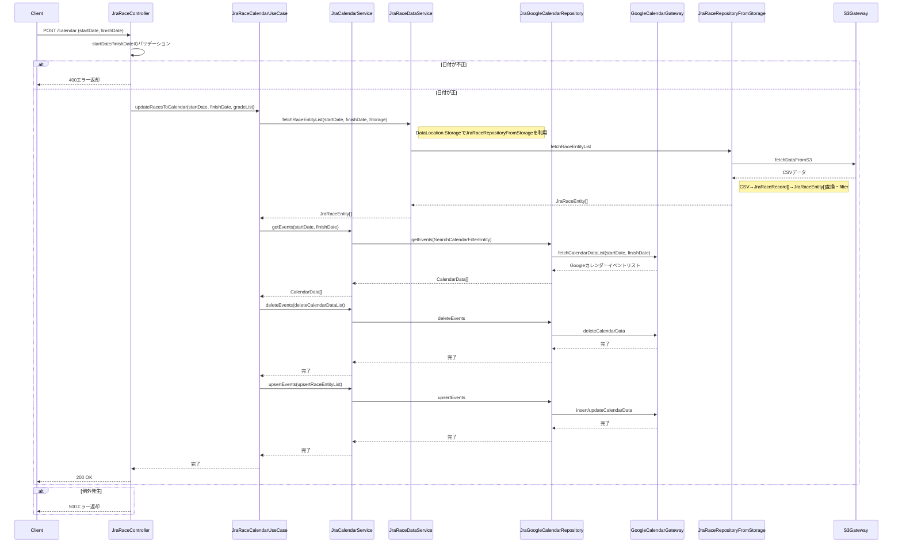

# updateRacesToCalendar シーケンス図（JRA）

```mermaid
sequenceDiagram
    participant Client
    participant JraRaceController
    participant JraRaceCalendarUseCase
    participant JraCalendarService
    participant JraRaceDataService
    participant JraGoogleCalendarRepository
    participant GoogleCalendarGateway

    Client->>JraRaceController: POST /calendar (startDate, finishDate)
    JraRaceController->>JraRaceController: startDate/finishDateのバリデーション
    alt 日付が不正
        JraRaceController-->>Client: 400エラー返却
    else 日付が正
        JraRaceController->>JraRaceCalendarUseCase: updateRacesToCalendar(startDate, finishDate, gradeList)
        JraRaceCalendarUseCase->>JraRaceDataService: fetchRaceEntityList(startDate, finishDate, Storage)
        note right of JraRaceDataService: DataLocation.StorageでJraRaceRepositoryFromStorageを利用
        JraRaceDataService->>JraRaceRepositoryFromStorage: fetchRaceEntityList
        JraRaceRepositoryFromStorage->>S3Gateway: fetchDataFromS3
        S3Gateway-->>JraRaceRepositoryFromStorage: CSVデータ
        note right of JraRaceRepositoryFromStorage: CSV→JraRaceRecord[]→JraRaceEntity[]変換・filter
        JraRaceRepositoryFromStorage-->>JraRaceDataService: JraRaceEntity[]
        JraRaceDataService-->>JraRaceCalendarUseCase: JraRaceEntity[]
        JraRaceCalendarUseCase->>JraCalendarService: getEvents(startDate, finishDate)
        JraCalendarService->>JraGoogleCalendarRepository: getEvents(SearchCalendarFilterEntity)
        JraGoogleCalendarRepository->>GoogleCalendarGateway: fetchCalendarDataList(startDate, finishDate)
        GoogleCalendarGateway-->>JraGoogleCalendarRepository: Googleカレンダーイベントリスト
        JraGoogleCalendarRepository-->>JraCalendarService: CalendarData[]
        JraCalendarService-->>JraRaceCalendarUseCase: CalendarData[]
        JraRaceCalendarUseCase->>JraCalendarService: deleteEvents(deleteCalendarDataList)
        JraCalendarService->>JraGoogleCalendarRepository: deleteEvents
        JraGoogleCalendarRepository->>GoogleCalendarGateway: deleteCalendarData
        GoogleCalendarGateway-->>JraGoogleCalendarRepository: 完了
        JraGoogleCalendarRepository-->>JraCalendarService: 完了
        JraCalendarService-->>JraRaceCalendarUseCase: 完了
        JraRaceCalendarUseCase->>JraCalendarService: upsertEvents(upsertRaceEntityList)
        JraCalendarService->>JraGoogleCalendarRepository: upsertEvents
        JraGoogleCalendarRepository->>GoogleCalendarGateway: insert/updateCalendarData
        GoogleCalendarGateway-->>JraGoogleCalendarRepository: 完了
        JraGoogleCalendarRepository-->>JraCalendarService: 完了
        JraCalendarService-->>JraRaceCalendarUseCase: 完了
        JraRaceCalendarUseCase-->>JraRaceController: 完了
        JraRaceController-->>Client: 200 OK
    end
    alt 例外発生
        JraRaceController-->>Client: 500エラー返却
    end
```
