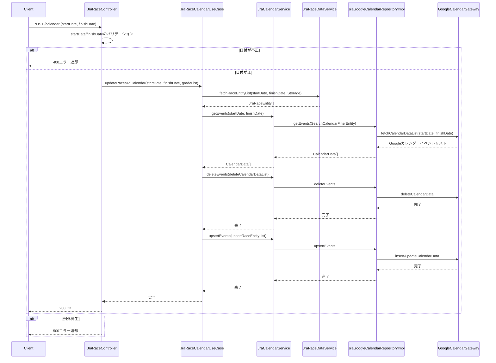

# updateRacesToCalendar シーケンス図（JRA）

```mermaid
sequenceDiagram
    participant Client
    participant JraRaceController
    participant JraRaceCalendarUseCase
    participant JraCalendarService
    participant JraRaceDataService
    participant JraGoogleCalendarRepositoryImpl
    participant GoogleCalendarGateway

    Client->>JraRaceController: POST /calendar (startDate, finishDate)
    JraRaceController->>JraRaceController: startDate/finishDateのバリデーション
    alt 日付が不正
        JraRaceController-->>Client: 400エラー返却
    else 日付が正
        JraRaceController->>JraRaceCalendarUseCase: updateRacesToCalendar(startDate, finishDate, gradeList)
        JraRaceCalendarUseCase->>JraRaceDataService: fetchRaceEntityList(startDate, finishDate, Storage)
        JraRaceDataService-->>JraRaceCalendarUseCase: JraRaceEntity[]
        JraRaceCalendarUseCase->>JraCalendarService: getEvents(startDate, finishDate)
        JraCalendarService->>JraGoogleCalendarRepositoryImpl: getEvents(SearchCalendarFilterEntity)
        JraGoogleCalendarRepositoryImpl->>GoogleCalendarGateway: fetchCalendarDataList(startDate, finishDate)
        GoogleCalendarGateway-->>JraGoogleCalendarRepositoryImpl: Googleカレンダーイベントリスト
        JraGoogleCalendarRepositoryImpl-->>JraCalendarService: CalendarData[]
        JraCalendarService-->>JraRaceCalendarUseCase: CalendarData[]
        JraRaceCalendarUseCase->>JraCalendarService: deleteEvents(deleteCalendarDataList)
        JraCalendarService->>JraGoogleCalendarRepositoryImpl: deleteEvents
        JraGoogleCalendarRepositoryImpl->>GoogleCalendarGateway: deleteCalendarData
        GoogleCalendarGateway-->>JraGoogleCalendarRepositoryImpl: 完了
        JraGoogleCalendarRepositoryImpl-->>JraCalendarService: 完了
        JraCalendarService-->>JraRaceCalendarUseCase: 完了
        JraRaceCalendarUseCase->>JraCalendarService: upsertEvents(upsertRaceEntityList)
        JraCalendarService->>JraGoogleCalendarRepositoryImpl: upsertEvents
        JraGoogleCalendarRepositoryImpl->>GoogleCalendarGateway: insert/updateCalendarData
        GoogleCalendarGateway-->>JraGoogleCalendarRepositoryImpl: 完了
        JraGoogleCalendarRepositoryImpl-->>JraCalendarService: 完了
        JraCalendarService-->>JraRaceCalendarUseCase: 完了
        JraRaceCalendarUseCase-->>JraRaceController: 完了
        JraRaceController-->>Client: 200 OK
    end
    alt 例外発生
        JraRaceController-->>Client: 500エラー返却
    end
```
