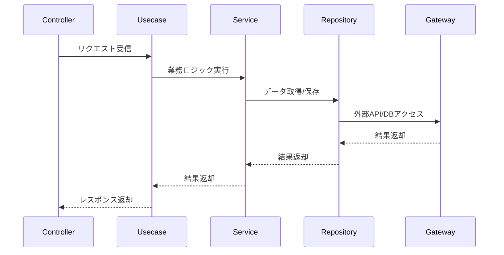

# シーケンス図（概要）

以下は、システム全体の主要なレイヤー間のやり取りを示すシーケンス図です。

```mermaid
sequenceDiagram
    participant Controller
    participant Usecase
    participant Service
    participant Repository
    participant Gateway

    Controller->>Usecase: リクエスト受信
    Usecase->>Service: 業務ロジック実行
    Service->>Repository: データ取得/保存
    Repository->>Gateway: 外部API/DBアクセス
    Gateway-->>Repository: 結果返却
    Repository-->>Service: 結果返却
    Service-->>Usecase: 結果返却
    Usecase-->>Controller: レスポンス返却
```
