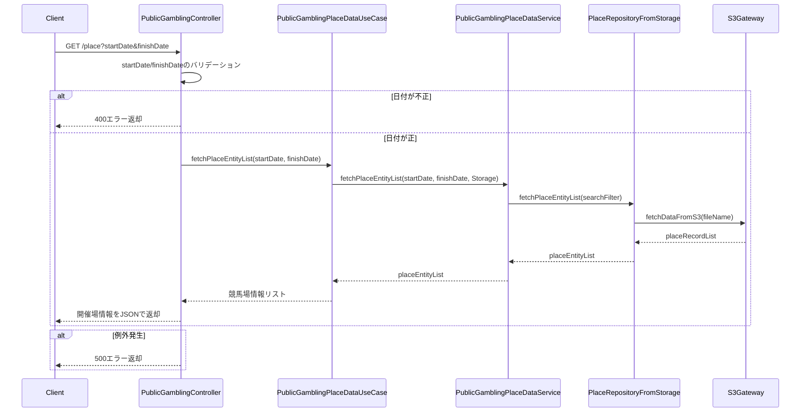

# getPlaceEntityList シーケンス図

```mermaid
sequenceDiagram
    participant Client
    participant PublicGamblingController
    participant PublicGamblingPlaceDataUseCase
    participant PublicGamblingPlaceDataService
    participant PlaceRepositoryFromStorage
    participant S3Gateway

    Client->>PublicGamblingController: GET /place?startDate&finishDate
    PublicGamblingController->>PublicGamblingController: startDate/finishDateのバリデーション
    alt 日付が不正
        PublicGamblingController-->>Client: 400エラー返却
    else 日付が正
        PublicGamblingController->>PublicGamblingPlaceDataUseCase: fetchPlaceEntityList(startDate, finishDate)
        PublicGamblingPlaceDataUseCase->>PublicGamblingPlaceDataService: fetchPlaceEntityList(startDate, finishDate, Storage)
        PublicGamblingPlaceDataService->>PlaceRepositoryFromStorage: fetchPlaceEntityList(searchFilter)
        PlaceRepositoryFromStorage->>S3Gateway: fetchDataFromS3(fileName)
        S3Gateway-->>PlaceRepositoryFromStorage: placeRecordList
        PlaceRepositoryFromStorage-->>PublicGamblingPlaceDataService: placeEntityList
        PublicGamblingPlaceDataService-->>PublicGamblingPlaceDataUseCase: placeEntityList
        PublicGamblingPlaceDataUseCase-->>PublicGamblingController: 競馬場情報リスト
        PublicGamblingController-->>Client: 開催場情報をJSONで返却
    end
    alt 例外発生
        PublicGamblingController-->>Client: 500エラー返却
    end
```
