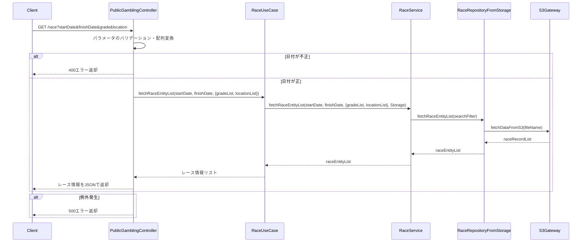

# getRaceEntityList シーケンス図

```mermaid
sequenceDiagram
    participant Client
    participant PublicGamblingController
    participant RaceUseCase
    participant RaceService
    participant RaceRepositoryFromStorage
    participant S3Gateway

    Client->>PublicGamblingController: GET /race?startDate&finishDate&grade&location
    PublicGamblingController->>PublicGamblingController: パラメータのバリデーション・配列変換
    alt 日付が不正
        PublicGamblingController-->>Client: 400エラー返却
    else 日付が正
        PublicGamblingController->>RaceUseCase: fetchRaceEntityList(startDate, finishDate, {gradeList, locationList})
        RaceUseCase->>RaceService: fetchRaceEntityList(startDate, finishDate, {gradeList, locationList}, Storage)
        RaceService->>RaceRepositoryFromStorage: fetchRaceEntityList(searchFilter)
        RaceRepositoryFromStorage->>S3Gateway: fetchDataFromS3(fileName)
        S3Gateway-->>RaceRepositoryFromStorage: raceRecordList
        RaceRepositoryFromStorage-->>RaceService: raceEntityList
        RaceService-->>RaceUseCase: raceEntityList
        RaceUseCase-->>PublicGamblingController: レース情報リスト
        PublicGamblingController-->>Client: レース情報をJSONで返却
    end
    alt 例外発生
        PublicGamblingController-->>Client: 500エラー返却
    end
```
