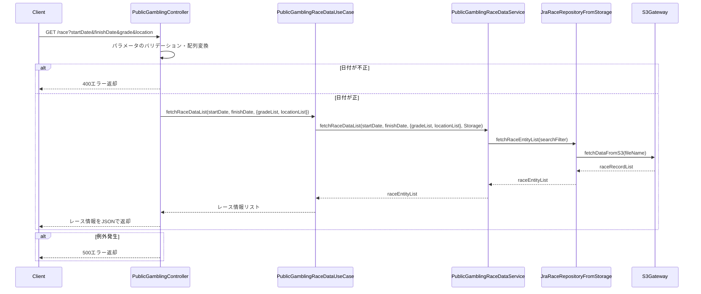

# getRaceDataList シーケンス図

```mermaid
sequenceDiagram
    participant Client
    participant PublicGamblingController
    participant PublicGamblingRaceDataUseCase
    participant PublicGamblingRaceDataService
    participant JraRaceRepositoryFromStorage
    participant S3Gateway

    Client->>PublicGamblingController: GET /race?startDate&finishDate&grade&location
    PublicGamblingController->>PublicGamblingController: パラメータのバリデーション・配列変換
    alt 日付が不正
        PublicGamblingController-->>Client: 400エラー返却
    else 日付が正
        PublicGamblingController->>PublicGamblingRaceDataUseCase: fetchRaceDataList(startDate, finishDate, {gradeList, locationList})
        PublicGamblingRaceDataUseCase->>PublicGamblingRaceDataService: fetchRaceDataList(startDate, finishDate, {gradeList, locationList}, Storage)
        PublicGamblingRaceDataService->>JraRaceRepositoryFromStorage: fetchRaceEntityList(searchFilter)
        JraRaceRepositoryFromStorage->>S3Gateway: fetchDataFromS3(fileName)
        S3Gateway-->>JraRaceRepositoryFromStorage: raceRecordList
        JraRaceRepositoryFromStorage-->>PublicGamblingRaceDataService: raceEntityList
        PublicGamblingRaceDataService-->>PublicGamblingRaceDataUseCase: raceEntityList
        PublicGamblingRaceDataUseCase-->>PublicGamblingController: レース情報リスト
        PublicGamblingController-->>Client: レース情報をJSONで返却
    end
    alt 例外発生
        PublicGamblingController-->>Client: 500エラー返却
    end
```
