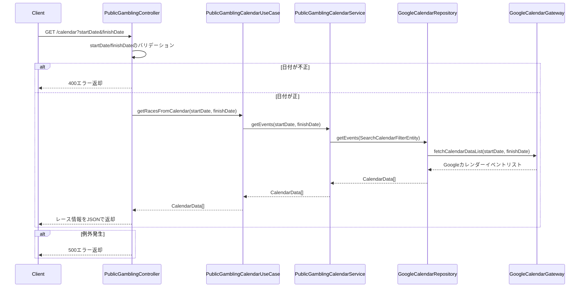

# getRacesFromCalendar シーケンス図

```mermaid
sequenceDiagram
    participant Client
    participant PublicGamblingController
    participant PublicGamblingCalendarUseCase
    participant PublicGamblingCalendarService
    participant GoogleCalendarRepository
    participant GoogleCalendarGateway

    Client->>PublicGamblingController: GET /calendar?startDate&finishDate
    PublicGamblingController->>PublicGamblingController: startDate/finishDateのバリデーション
    alt 日付が不正
        PublicGamblingController-->>Client: 400エラー返却
    else 日付が正
        PublicGamblingController->>PublicGamblingCalendarUseCase: getRacesFromCalendar(startDate, finishDate)
        PublicGamblingCalendarUseCase->>PublicGamblingCalendarService: getEvents(startDate, finishDate)
        PublicGamblingCalendarService->>GoogleCalendarRepository: getEvents(SearchCalendarFilterEntity)
        GoogleCalendarRepository->>GoogleCalendarGateway: fetchCalendarDataList(startDate, finishDate)
        GoogleCalendarGateway-->>GoogleCalendarRepository: Googleカレンダーイベントリスト
        GoogleCalendarRepository-->>PublicGamblingCalendarService: CalendarData[]
        PublicGamblingCalendarService-->>PublicGamblingCalendarUseCase: CalendarData[]
        PublicGamblingCalendarUseCase-->>PublicGamblingController: CalendarData[]
        PublicGamblingController-->>Client: レース情報をJSONで返却
    end
    alt 例外発生
        PublicGamblingController-->>Client: 500エラー返却
    end
```
