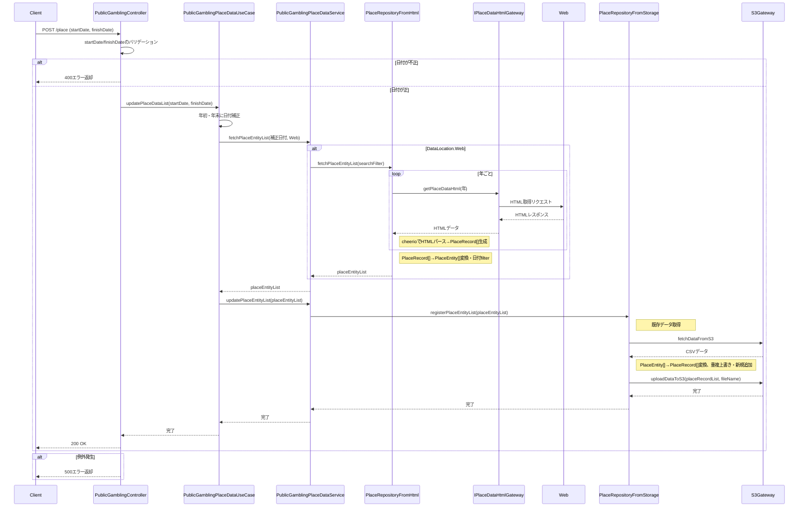

# updatePlaceDataList シーケンス図

```mermaid
sequenceDiagram
    participant Client
    participant PublicGamblingController
    participant PublicGamblingPlaceDataUseCase
    participant PublicGamblingPlaceDataService
    participant PlaceRepositoryFromHtml
    participant IPlaceDataHtmlGateway
    participant Web
    participant PlaceRepositoryFromStorage
    participant S3Gateway

    Client->>PublicGamblingController: POST /place (startDate, finishDate)
    PublicGamblingController->>PublicGamblingController: startDate/finishDateのバリデーション
    alt 日付が不正
        PublicGamblingController-->>Client: 400エラー返却
    else 日付が正
        PublicGamblingController->>PublicGamblingPlaceDataUseCase: updatePlaceDataList(startDate, finishDate)
        PublicGamblingPlaceDataUseCase->>PublicGamblingPlaceDataUseCase: 年初・年末に日付補正
        PublicGamblingPlaceDataUseCase->>PublicGamblingPlaceDataService: fetchPlaceEntityList(補正日付, Web)
        alt DataLocation.Web
            PublicGamblingPlaceDataService->>PlaceRepositoryFromHtml: fetchPlaceEntityList(searchFilter)
            loop 年ごと
                PlaceRepositoryFromHtml->>IPlaceDataHtmlGateway: getPlaceDataHtml(年)
                IPlaceDataHtmlGateway->>Web: HTML取得リクエスト
                Web-->>IPlaceDataHtmlGateway: HTMLレスポンス
                IPlaceDataHtmlGateway-->>PlaceRepositoryFromHtml: HTMLデータ
                note right of PlaceRepositoryFromHtml: cheerioでHTMLパース→PlaceRecord[]生成
            end
            note right of PlaceRepositoryFromHtml: PlaceRecord[]→PlaceEntity[]変換・日付filter
            PlaceRepositoryFromHtml-->>PublicGamblingPlaceDataService: placeEntityList
        end
        PublicGamblingPlaceDataService-->>PublicGamblingPlaceDataUseCase: placeEntityList
        PublicGamblingPlaceDataUseCase->>PublicGamblingPlaceDataService: updatePlaceEntityList(placeEntityList)
        PublicGamblingPlaceDataService->>PlaceRepositoryFromStorage: registerPlaceEntityList(placeEntityList)
        note right of PlaceRepositoryFromStorage: 既存データ取得
        PlaceRepositoryFromStorage->>S3Gateway: fetchDataFromS3
        S3Gateway-->>PlaceRepositoryFromStorage: CSVデータ
        note right of PlaceRepositoryFromStorage: PlaceEntity[]→PlaceRecord[]変換、重複上書き・新規追加
        PlaceRepositoryFromStorage->>S3Gateway: uploadDataToS3(placeRecordList, fileName)
        S3Gateway-->>PlaceRepositoryFromStorage: 完了
        PlaceRepositoryFromStorage-->>PublicGamblingPlaceDataService: 完了
        PublicGamblingPlaceDataService-->>PublicGamblingPlaceDataUseCase: 完了
        PublicGamblingPlaceDataUseCase-->>PublicGamblingController: 完了
        PublicGamblingController-->>Client: 200 OK
    end
    alt 例外発生
        PublicGamblingController-->>Client: 500エラー返却
    end
```
