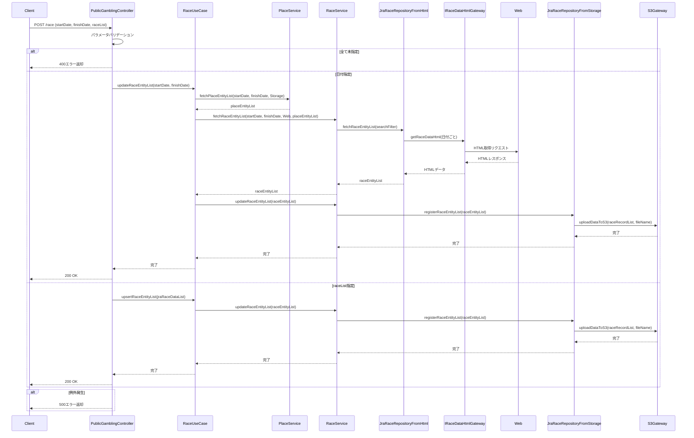

# updateRaceEntityList シーケンス図

```mermaid
sequenceDiagram
    participant Client
    participant PublicGamblingController
    participant RaceUseCase
    participant PlaceService
    participant RaceService
    participant JraRaceRepositoryFromHtml
    participant IRaceDataHtmlGateway
    participant Web
    participant JraRaceRepositoryFromStorage
    participant S3Gateway

    Client->>PublicGamblingController: POST /race (startDate, finishDate, raceList)
    PublicGamblingController->>PublicGamblingController: パラメータバリデーション
    alt 全て未指定
        PublicGamblingController-->>Client: 400エラー返却
    else 日付指定
        PublicGamblingController->>RaceUseCase: updateRaceEntityList(startDate, finishDate)
        RaceUseCase->>PlaceService: fetchPlaceEntityList(startDate, finishDate, Storage)
        PlaceService-->>RaceUseCase: placeEntityList
        RaceUseCase->>RaceService: fetchRaceEntityList(startDate, finishDate, Web, placeEntityList)
        RaceService->>JraRaceRepositoryFromHtml: fetchRaceEntityList(searchFilter)
        JraRaceRepositoryFromHtml->>IRaceDataHtmlGateway: getRaceDataHtml(日付ごと)
        IRaceDataHtmlGateway->>Web: HTML取得リクエスト
        Web-->>IRaceDataHtmlGateway: HTMLレスポンス
        IRaceDataHtmlGateway-->>JraRaceRepositoryFromHtml: HTMLデータ
        JraRaceRepositoryFromHtml-->>RaceService: raceEntityList
        RaceService-->>RaceUseCase: raceEntityList
        RaceUseCase->>RaceService: updateRaceEntityList(raceEntityList)
        RaceService->>JraRaceRepositoryFromStorage: registerRaceEntityList(raceEntityList)
        JraRaceRepositoryFromStorage->>S3Gateway: uploadDataToS3(raceRecordList, fileName)
        S3Gateway-->>JraRaceRepositoryFromStorage: 完了
        JraRaceRepositoryFromStorage-->>RaceService: 完了
        RaceService-->>RaceUseCase: 完了
        RaceUseCase-->>PublicGamblingController: 完了
        PublicGamblingController-->>Client: 200 OK
    else raceList指定
        PublicGamblingController->>RaceUseCase: upsertRaceEntityList(jraRaceDataList)
        RaceUseCase->>RaceService: updateRaceEntityList(raceEntityList)
        RaceService->>JraRaceRepositoryFromStorage: registerRaceEntityList(raceEntityList)
        JraRaceRepositoryFromStorage->>S3Gateway: uploadDataToS3(raceRecordList, fileName)
        S3Gateway-->>JraRaceRepositoryFromStorage: 完了
        JraRaceRepositoryFromStorage-->>RaceService: 完了
        RaceService-->>RaceUseCase: 完了
        RaceUseCase-->>PublicGamblingController: 完了
        PublicGamblingController-->>Client: 200 OK
    end
    alt 例外発生
        PublicGamblingController-->>Client: 500エラー返却
    end
```
