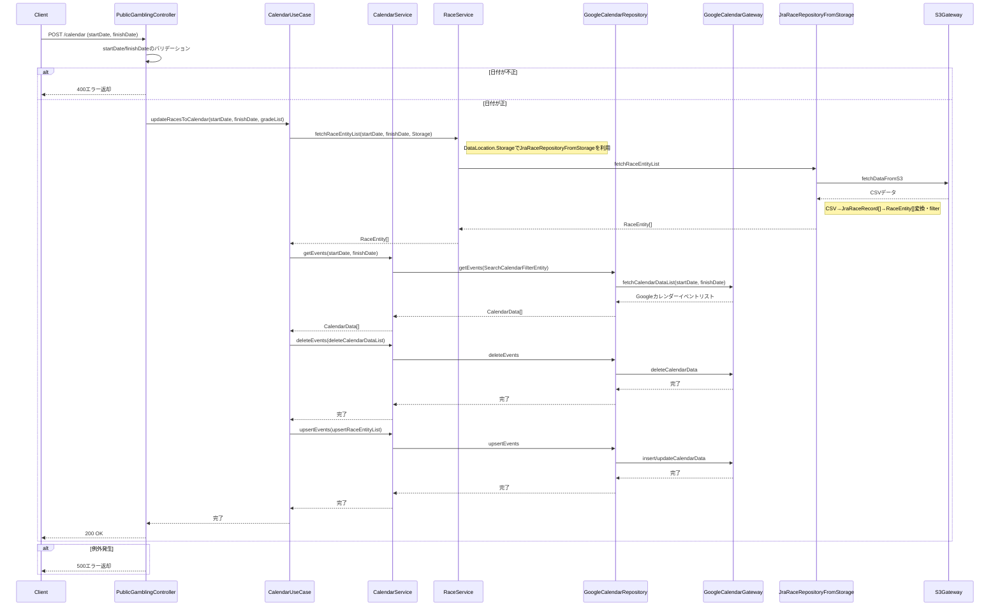

# updateRacesToCalendar シーケンス図

```mermaid
sequenceDiagram
    participant Client
    participant PublicGamblingController
    participant CalendarUseCase
    participant CalendarService
    participant RaceService
    participant GoogleCalendarRepository
    participant GoogleCalendarGateway

    Client->>PublicGamblingController: POST /calendar (startDate, finishDate)
    PublicGamblingController->>PublicGamblingController: startDate/finishDateのバリデーション
    alt 日付が不正
        PublicGamblingController-->>Client: 400エラー返却
    else 日付が正
        PublicGamblingController->>CalendarUseCase: updateRacesToCalendar(startDate, finishDate, gradeList)
        CalendarUseCase->>RaceService: fetchRaceEntityList(startDate, finishDate, Storage)
        note right of RaceService: DataLocation.StorageでJraRaceRepositoryFromStorageを利用
        RaceService->>JraRaceRepositoryFromStorage: fetchRaceEntityList
        JraRaceRepositoryFromStorage->>S3Gateway: fetchDataFromS3
        S3Gateway-->>JraRaceRepositoryFromStorage: CSVデータ
        note right of JraRaceRepositoryFromStorage: CSV→JraRaceRecord[]→RaceEntity[]変換・filter
        JraRaceRepositoryFromStorage-->>RaceService: RaceEntity[]
        RaceService-->>CalendarUseCase: RaceEntity[]
        CalendarUseCase->>CalendarService: getEvents(startDate, finishDate)
        CalendarService->>GoogleCalendarRepository: getEvents(SearchCalendarFilterEntity)
        GoogleCalendarRepository->>GoogleCalendarGateway: fetchCalendarDataList(startDate, finishDate)
        GoogleCalendarGateway-->>GoogleCalendarRepository: Googleカレンダーイベントリスト
        GoogleCalendarRepository-->>CalendarService: CalendarData[]
        CalendarService-->>CalendarUseCase: CalendarData[]
        CalendarUseCase->>CalendarService: deleteEvents(deleteCalendarDataList)
        CalendarService->>GoogleCalendarRepository: deleteEvents
        GoogleCalendarRepository->>GoogleCalendarGateway: deleteCalendarData
        GoogleCalendarGateway-->>GoogleCalendarRepository: 完了
        GoogleCalendarRepository-->>CalendarService: 完了
        CalendarService-->>CalendarUseCase: 完了
        CalendarUseCase->>CalendarService: upsertEvents(upsertRaceEntityList)
        CalendarService->>GoogleCalendarRepository: upsertEvents
        GoogleCalendarRepository->>GoogleCalendarGateway: insert/updateCalendarData
        GoogleCalendarGateway-->>GoogleCalendarRepository: 完了
        GoogleCalendarRepository-->>CalendarService: 完了
        CalendarService-->>CalendarUseCase: 完了
        CalendarUseCase-->>PublicGamblingController: 完了
        PublicGamblingController-->>Client: 200 OK
    end
    alt 例外発生
        PublicGamblingController-->>Client: 500エラー返却
    end
```
