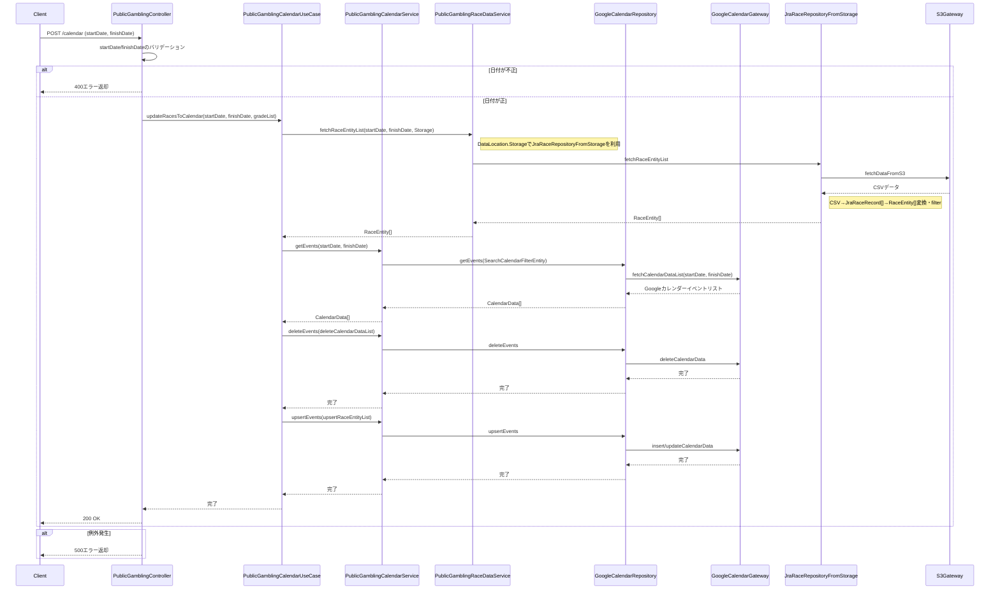

# updateRacesToCalendar シーケンス図

```mermaid
sequenceDiagram
    participant Client
    participant PublicGamblingController
    participant PublicGamblingCalendarUseCase
    participant PublicGamblingCalendarService
    participant PublicGamblingRaceDataService
    participant GoogleCalendarRepository
    participant GoogleCalendarGateway

    Client->>PublicGamblingController: POST /calendar (startDate, finishDate)
    PublicGamblingController->>PublicGamblingController: startDate/finishDateのバリデーション
    alt 日付が不正
        PublicGamblingController-->>Client: 400エラー返却
    else 日付が正
        PublicGamblingController->>PublicGamblingCalendarUseCase: updateRacesToCalendar(startDate, finishDate, gradeList)
        PublicGamblingCalendarUseCase->>PublicGamblingRaceDataService: fetchRaceEntityList(startDate, finishDate, Storage)
        note right of PublicGamblingRaceDataService: DataLocation.StorageでJraRaceRepositoryFromStorageを利用
        PublicGamblingRaceDataService->>JraRaceRepositoryFromStorage: fetchRaceEntityList
        JraRaceRepositoryFromStorage->>S3Gateway: fetchDataFromS3
        S3Gateway-->>JraRaceRepositoryFromStorage: CSVデータ
        note right of JraRaceRepositoryFromStorage: CSV→JraRaceRecord[]→RaceEntity[]変換・filter
        JraRaceRepositoryFromStorage-->>PublicGamblingRaceDataService: RaceEntity[]
        PublicGamblingRaceDataService-->>PublicGamblingCalendarUseCase: RaceEntity[]
        PublicGamblingCalendarUseCase->>PublicGamblingCalendarService: getEvents(startDate, finishDate)
        PublicGamblingCalendarService->>GoogleCalendarRepository: getEvents(SearchCalendarFilterEntity)
        GoogleCalendarRepository->>GoogleCalendarGateway: fetchCalendarDataList(startDate, finishDate)
        GoogleCalendarGateway-->>GoogleCalendarRepository: Googleカレンダーイベントリスト
        GoogleCalendarRepository-->>PublicGamblingCalendarService: CalendarData[]
        PublicGamblingCalendarService-->>PublicGamblingCalendarUseCase: CalendarData[]
        PublicGamblingCalendarUseCase->>PublicGamblingCalendarService: deleteEvents(deleteCalendarDataList)
        PublicGamblingCalendarService->>GoogleCalendarRepository: deleteEvents
        GoogleCalendarRepository->>GoogleCalendarGateway: deleteCalendarData
        GoogleCalendarGateway-->>GoogleCalendarRepository: 完了
        GoogleCalendarRepository-->>PublicGamblingCalendarService: 完了
        PublicGamblingCalendarService-->>PublicGamblingCalendarUseCase: 完了
        PublicGamblingCalendarUseCase->>PublicGamblingCalendarService: upsertEvents(upsertRaceEntityList)
        PublicGamblingCalendarService->>GoogleCalendarRepository: upsertEvents
        GoogleCalendarRepository->>GoogleCalendarGateway: insert/updateCalendarData
        GoogleCalendarGateway-->>GoogleCalendarRepository: 完了
        GoogleCalendarRepository-->>PublicGamblingCalendarService: 完了
        PublicGamblingCalendarService-->>PublicGamblingCalendarUseCase: 完了
        PublicGamblingCalendarUseCase-->>PublicGamblingController: 完了
        PublicGamblingController-->>Client: 200 OK
    end
    alt 例外発生
        PublicGamblingController-->>Client: 500エラー返却
    end
```
