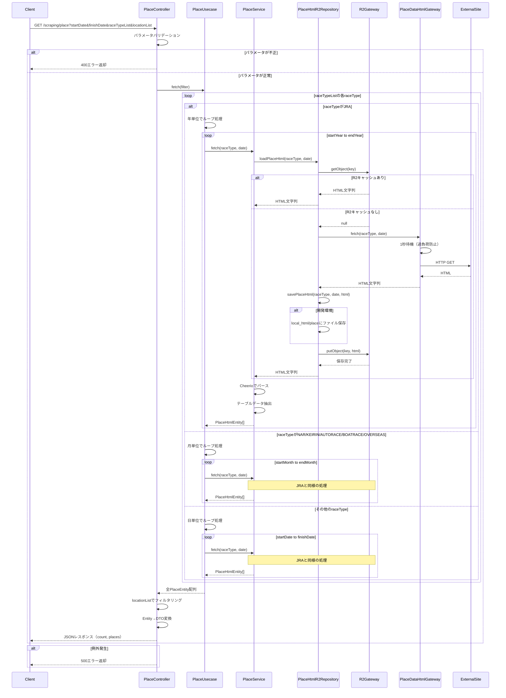

# getPlaceList シーケンス図

スクレイピングサービスによる開催場データ取得のシーケンス図です。



## 主要な処理フロー

### 1. パラメータバリデーション（PlaceController）
- `startDate`, `finishDate`, `raceTypeList` の必須チェック
- 日付の妥当性チェック
- `raceTypeList` のカンマ区切り解析
- `locationList` のオプショナルパース

### 2. 日付範囲の処理（PlaceUsecase）
- **JRA**: 年単位でデータ取得（例: 2026年全体）
- **NAR/KEIRIN/AUTORACE/BOATRACE/OVERSEAS**: 月単位でデータ取得（例: 2026年1月）
- **その他**: 日単位でデータ取得

### 3. HTMLスクレイピング（PlaceService）
- Cheerioを使用したHTMLパース
- `.chartWrapprer > table > tbody > tr` からデータ抽出
- `●`, `☆`, `Ｄ` を含むセルから開催日を判定
- `PlaceHtmlEntity` オブジェクトの生成

### 4. キャッシュ戦略（PlaceHtmlR2Repository）
- **2段階キャッシュ**:
  1. R2オブジェクトストレージからロード
  2. キャッシュミス時は外部サイトから取得
- **キャッシュキー生成**:
  - JRA: `place/JRA{年}.html`
  - その他: `place/{raceType}{yyyyMM}.html`
- **開発環境**: `local_html/place/` にHTMLファイルを物理保存

### 5. 外部サイトアクセス（PlaceDataHtmlGateway）
- URL生成（`createPlaceUrl` ユーティリティ使用）
- 1秒の待機時間（過負荷防止）
- fetch APIで外部サイトから取得
- エラーハンドリング

### 6. R2ストレージ操作（R2Gateway）
- Cloudflare R2バケットへのアクセス
- `getObject`, `putObject`, `deleteObject` の実装
- バケット未設定時はスキップ（null返却）

## エラーハンドリング

- パラメータエラー: 400エラーを返却
- 外部サイト取得失敗: 例外をスロー → 500エラー
- その他の例外: 500エラーを返却

## レスポンス形式

```json
{
  "count": 10,
  "places": [
    {
      "placeId": "string",
      "raceType": "JRA",
      "datetime": "2026-01-01T00:00:00.000Z",
      "placeName": "東京",
      "locationName": "東京",
      "placeGrade": "G1",
      "placeHeldDays": []
    }
  ]
}
```
