# getRaceList シーケンス図

スクレイピングによるレースデータ取得のシーケンス図です。

```mermaid
sequenceDiagram
    participant Client
    participant RaceController
    participant RaceUsecase
    participant RaceRepositoryFromHtml
    participant RaceDataHtmlGateway
    participant ExternalSite

    Client->>RaceController: GET /scraping/race?startDate&finishDate&raceTypeList&locationList&gradeList
    RaceController->>RaceController: パラメータバリデーション
    alt パラメータが不正
        RaceController-->>Client: 400エラー返却
    else パラメータが正常
        RaceController->>RaceUsecase: fetch(searchFilter)

        Note over RaceUsecase: 事前にPlaceEntityListを取得済み

        RaceUsecase->>RaceRepositoryFromHtml: fetchRaceEntityList(searchFilter, placeEntityList)

        RaceRepositoryFromHtml->>RaceRepositoryFromHtml: gradeListでplaceEntityListをフィルタ

        loop 各placeEntity
            alt raceTypeがJRA
                RaceRepositoryFromHtml->>RaceRepositoryFromHtml: fetchRaceListFromHtmlForJra(placeEntity)
                RaceRepositoryFromHtml->>RaceDataHtmlGateway: getRaceDataHtml(JRA, date, place, number)
                RaceDataHtmlGateway->>RaceDataHtmlGateway: createRaceUrl(JRA, date, place, number)
                RaceDataHtmlGateway->>ExternalSite: fetch(url)
                ExternalSite-->>RaceDataHtmlGateway: HTML
                RaceDataHtmlGateway-->>RaceRepositoryFromHtml: HTML文字列
                RaceRepositoryFromHtml->>RaceRepositoryFromHtml: Cheerioでパース（.hr-tableSchedule）
                RaceRepositoryFromHtml->>RaceRepositoryFromHtml: レースデータ抽出・RaceEntity生成

            else raceTypeがNAR
                RaceRepositoryFromHtml->>RaceRepositoryFromHtml: fetchRaceListFromHtmlForNar(placeEntity)
                RaceRepositoryFromHtml->>RaceDataHtmlGateway: getRaceDataHtml(NAR, date, place)
                RaceDataHtmlGateway->>RaceDataHtmlGateway: createRaceUrl(NAR, date, place)
                RaceDataHtmlGateway->>ExternalSite: fetch(url)
                ExternalSite-->>RaceDataHtmlGateway: HTML
                RaceDataHtmlGateway-->>RaceRepositoryFromHtml: HTML文字列
                RaceRepositoryFromHtml->>RaceRepositoryFromHtml: Cheerioでパース（section.raceTable）
                RaceRepositoryFromHtml->>RaceRepositoryFromHtml: レースデータ抽出・RaceEntity生成

            else raceTypeがOVERSEAS
                RaceRepositoryFromHtml->>RaceRepositoryFromHtml: fetchRaceListFromHtmlForOverseas(placeEntity)
                RaceRepositoryFromHtml->>RaceDataHtmlGateway: getRaceDataHtml(OVERSEAS, date)
                RaceDataHtmlGateway->>RaceDataHtmlGateway: createRaceUrl(OVERSEAS, date)
                RaceDataHtmlGateway->>ExternalSite: fetch(url)
                ExternalSite-->>RaceDataHtmlGateway: HTML
                RaceDataHtmlGateway-->>RaceRepositoryFromHtml: HTML文字列
                RaceRepositoryFromHtml->>RaceRepositoryFromHtml: Cheerioでパース（.racelist）
                RaceRepositoryFromHtml->>RaceRepositoryFromHtml: レースデータ抽出・RaceEntity生成

            else raceTypeがKEIRIN
                RaceRepositoryFromHtml->>RaceRepositoryFromHtml: fetchRaceListFromHtmlForKeirin(placeEntity)
                RaceRepositoryFromHtml->>RaceDataHtmlGateway: getRaceDataHtml(KEIRIN, date, place)
                RaceDataHtmlGateway->>RaceDataHtmlGateway: createRaceUrl(KEIRIN, date, place)
                RaceDataHtmlGateway->>ExternalSite: fetch(url)
                ExternalSite-->>RaceDataHtmlGateway: HTML
                RaceDataHtmlGateway-->>RaceRepositoryFromHtml: HTML文字列
                RaceRepositoryFromHtml->>RaceRepositoryFromHtml: Cheerioでパース（#content）
                RaceRepositoryFromHtml->>RaceRepositoryFromHtml: レースデータ抽出・RaceEntity生成

            else raceTypeがAUTORACE
                RaceRepositoryFromHtml->>RaceRepositoryFromHtml: fetchRaceListFromHtmlForAutorace(placeEntity)
                RaceRepositoryFromHtml->>RaceDataHtmlGateway: getRaceDataHtml(AUTORACE, date, place)
                RaceDataHtmlGateway->>RaceDataHtmlGateway: createRaceUrl(AUTORACE, date, place)
                RaceDataHtmlGateway->>ExternalSite: fetch(url)
                ExternalSite-->>RaceDataHtmlGateway: HTML
                RaceDataHtmlGateway-->>RaceRepositoryFromHtml: HTML文字列
                RaceRepositoryFromHtml->>RaceRepositoryFromHtml: Cheerioでパース（.section）
                RaceRepositoryFromHtml->>RaceRepositoryFromHtml: レースデータ抽出・RaceEntity生成

            else raceTypeがBOATRACE
                RaceRepositoryFromHtml->>RaceRepositoryFromHtml: fetchRaceListFromHtmlForBoatrace(placeEntity)
                RaceRepositoryFromHtml->>RaceDataHtmlGateway: getRaceDataHtml(BOATRACE, date, place)
                RaceDataHtmlGateway->>RaceDataHtmlGateway: createRaceUrl(BOATRACE, date, place)
                RaceDataHtmlGateway->>ExternalSite: fetch(url)
                ExternalSite-->>RaceDataHtmlGateway: HTML
                RaceDataHtmlGateway-->>RaceRepositoryFromHtml: HTML文字列
                RaceRepositoryFromHtml->>RaceRepositoryFromHtml: Cheerioでパース（.heading2_titleName）
                RaceRepositoryFromHtml->>RaceRepositoryFromHtml: レースデータ抽出・RaceEntity生成
            end
        end

        RaceRepositoryFromHtml-->>RaceUsecase: RaceEntity[]
        RaceUsecase-->>RaceController: raceEntityList
        RaceController->>RaceController: Entity→DTO変換
        RaceController-->>Client: JSONレスポンス（count, races）
    end

    alt 例外発生
        RaceController-->>Client: 500エラー返却
    end
```



## 主要な処理フロー

### 1. パラメータバリデーション（RaceController）
- `startDate`, `finishDate`, `raceTypeList` の必須チェック
- `gradeList`, `locationList` のオプショナルパース
- 日付の妥当性チェック

### 2. PlaceEntity取得（事前処理）
- レース取得前に、対象期間の開催場情報を取得
- `gradeList` によるフィルタリング（JRA/NAR/OVERSEASは全グレード対象）

### 3. レースHTMLスクレイピング（RaceRepositoryFromHtml）

#### **JRA（中央競馬）**
- **URL生成**: `createRaceUrl(JRA, date, place, number)`
- **HTMLパース**: `.hr-tableSchedule` クラスのテーブルを解析
- **抽出データ**:
  - レース番号、レース名、グレード
  - 発走時刻、距離、馬場状態
  - 競走条件（年齢制限、性別制限、重量条件）

#### **NAR（地方競馬）**
- **URL生成**: `createRaceUrl(NAR, date, place)`
- **HTMLパース**: `section.raceTable` を解析
- **抽出データ**:
  - レース番号、レース名
  - 発走時刻、距離、トラック種別
  - ダート/芝の区別

#### **OVERSEAS（海外競馬）**
- **URL生成**: `createRaceUrl(OVERSEAS, date)`
- **HTMLパース**: `.racelist` クラスを解析
- **抽出データ**:
  - レース名、開催地、発走時刻
  - 距離、トラック条件

#### **KEIRIN（競輪）**
- **URL生成**: `createRaceUrl(KEIRIN, date, place)`
- **HTMLパース**: `#content` セクションを解析
- **抽出データ**:
  - レース番号、グレード
  - 発走時刻、距離
  - 競走種別（予選、決勝など）

#### **AUTORACE（オートレース）**
- **URL生成**: `createRaceUrl(AUTORACE, date, place)`
- **HTMLパース**: `.section` クラスを解析
- **抽出データ**:
  - レース番号、レース名
  - 発走時刻、周回数

#### **BOATRACE（ボートレース）**
- **URL生成**: `createRaceUrl(BOATRACE, date, place)`
- **HTMLパース**: `.heading2_titleName` クラスを解析
- **抽出データ**:
  - レース番号、レース名
  - 発走時刻、距離
  - グレード情報

### 4. 外部サイトアクセス（RaceDataHtmlGateway）
- `createRaceUrl()` でレース種別ごとの適切なURLを生成
- fetch APIで外部サイトから取得
- エラーハンドリング（TypeError スロー）

### 5. データ変換
- Cheerioでパースした生データから `RaceEntity` を生成
- レース種別ごとに異なるパースロジック適用
- バリデーション処理（距離、グレード、コースなど）

## 現在の実装場所と移行計画

### 現在の実装
- **場所**: `src/repository/implement/raceRepositoryFromHtml.ts` (1,212行)
- **Gateway**: `src/gateway/implement/raceDataHtmlGateway.ts` (41行)

### 移行先（予定）
- **Service**: `packages/scraping/src/service/raceService.ts` (新規作成)
- **Repository**: `packages/scraping/src/repository/implement/raceHtmlRepository.ts` (新規作成)
- **Gateway**: `packages/scraping/src/gateway/implement/raceDataHtmlGateway.ts` (新規作成)
- **Controller**: `packages/scraping/src/controller/raceController.ts` (新規作成)
- **Usecase**: `packages/scraping/src/usecase/raceUsecase.ts` (新規作成)

### 移行のメリット
1. **R2キャッシング対応**: Place同様、HTMLをR2バケットにキャッシュ
2. **開発環境対応**: `local_html/race/` にHTMLを物理保存してデバッグ容易化
3. **クリーンアーキテクチャ**: 層分離による保守性向上
4. **独立デプロイ**: Cloudflare Workersとして独立稼働

## エラーハンドリング

- パラメータエラー: 400エラーを返却
- 外部サイト取得失敗: TypeError をスロー → 500エラー
- HTMLパースエラー: ログ出力 → 空配列返却
- その他の例外: 500エラーを返却

## レスポンス形式（想定）

```json
{
  "count": 48,
  "races": [
    {
      "raceId": "2026010101",
      "raceType": "JRA",
      "datetime": "2026-01-01T10:00:00.000Z",
      "raceName": "ホープフルS",
      "placeId": "05",
      "placeName": "中山",
      "grade": "G1",
      "distance": 2000,
      "surfaceType": "芝",
      "raceNumber": 11
    }
  ]
}
```
