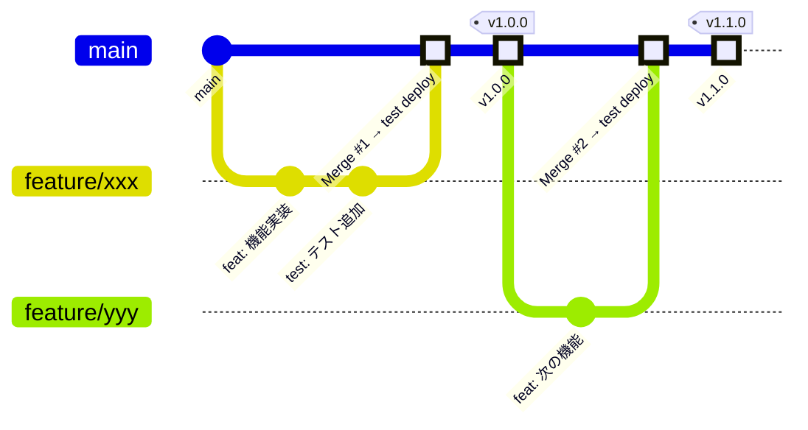
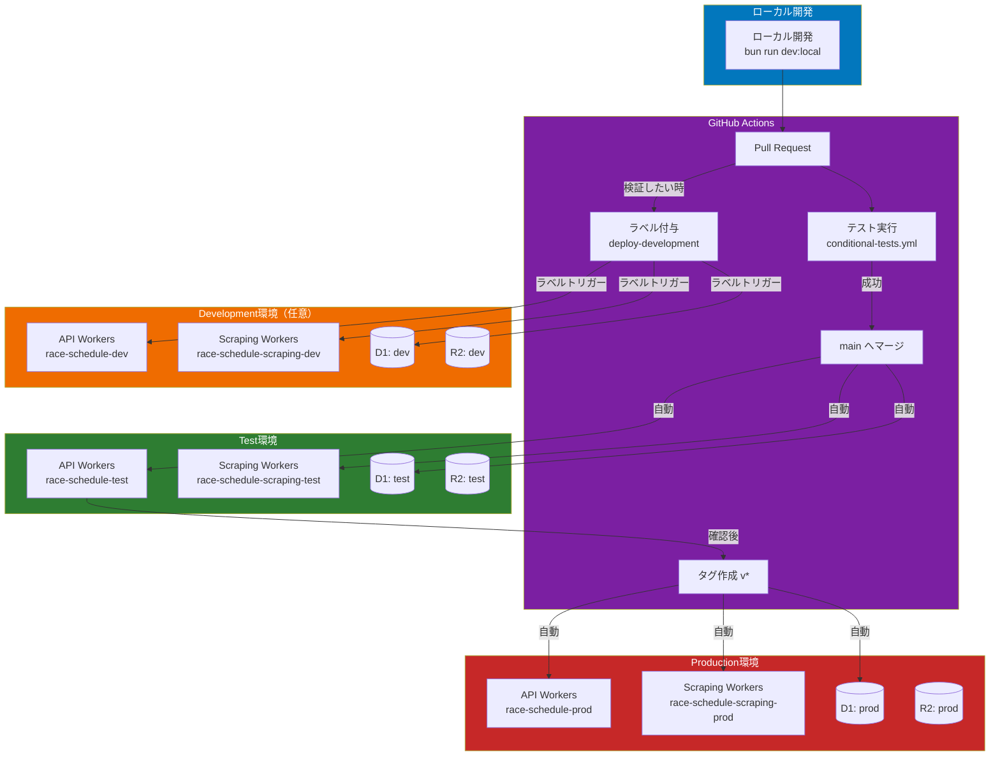
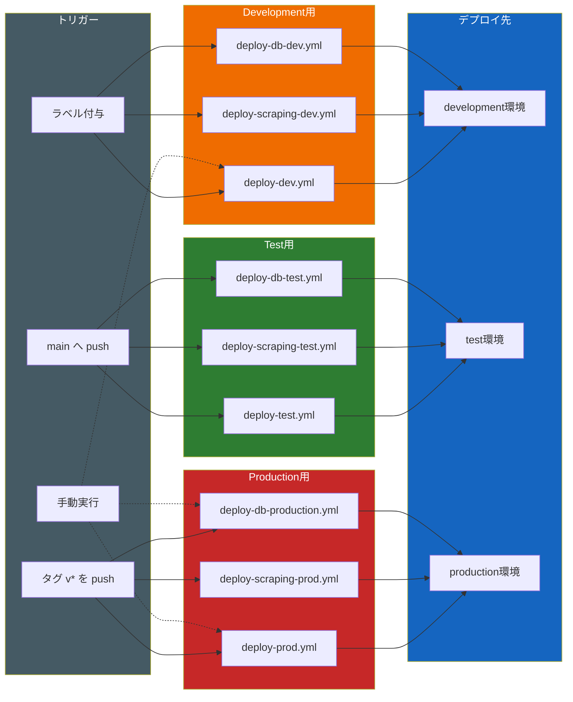
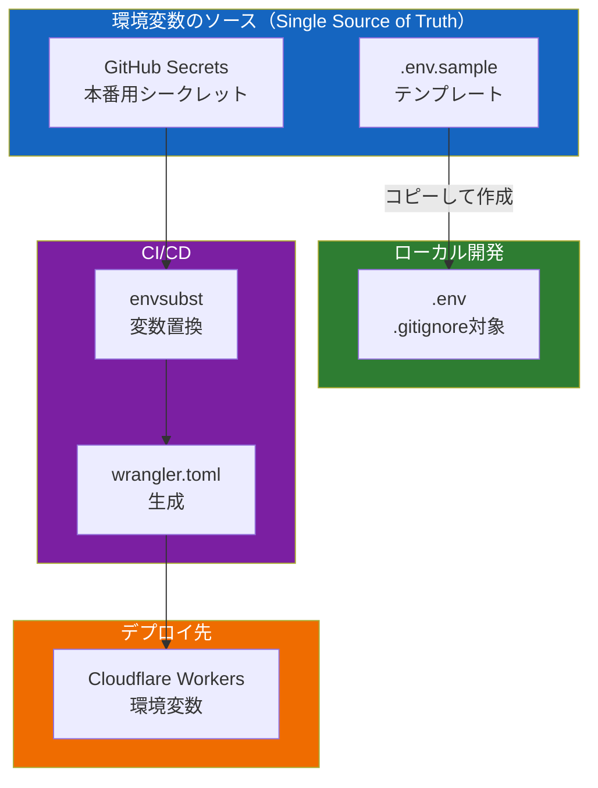
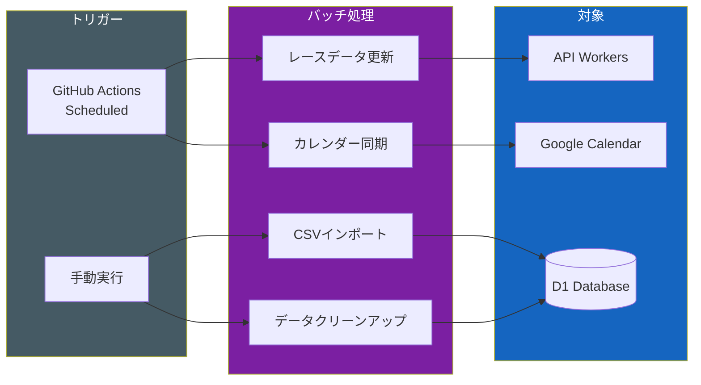

# packages 運用ガイド

このドキュメントでは、race-schedule プロジェクトの monorepo 構成における packages ディレクトリの運用方法をまとめています。

---

## 目次

1. [パッケージ構成](#パッケージ構成)
2. [アーキテクチャ設計](#アーキテクチャ設計)
3. [開発フロー](#開発フロー)
4. [Gitフロー](#gitフロー)
5. [デプロイフロー](#デプロイフロー)
6. [環境変数管理](#環境変数管理)
7. [バッチ処理](#バッチ処理)
8. [主要コマンド](#主要コマンド)

---

## パッケージ構成

```
packages/
├── api/        # メインAPI（Cloudflare Workers + D1）
├── scraping/   # HTMLスクレイピングワーカー（Cloudflare Workers + R2）
├── shared/     # 共有型・ユーティリティ・ドメインモデル
├── db/         # データベーススキーマ・マイグレーション管理
├── batch/      # バッチ処理スクリプト
└── front/      # フロントエンドアプリケーション
```

| パッケージ | 役割 | ランタイム | ストレージ |
|-----------|------|-----------|-----------|
| `@race-schedule/api` | メインAPIサーバー | Cloudflare Workers | D1（SQLite） |
| `@race-schedule/scraping` | HTMLスクレイピング | Cloudflare Workers | R2 |
| `@race-schedule/shared` | 共有ライブラリ | - | - |
| `@race-schedule/db` | DBマイグレーション | - | D1 |
| `@race-schedule/batch` | バッチ処理 | Node.js / Bun | D1 / Google Sheets |
| `@race-schedule/front` | フロントエンド | - | - |

### 依存関係

```
api ──────────────────┐
                      ├──► shared
scraping ─────────────┤
                      │
batch ────────────────┼──► db
                      │
front ────────────────┘
```

---

## アーキテクチャ設計

### レイヤーアーキテクチャ

各パッケージは以下のレイヤー構成に準拠します（src ディレクトリと同様）。

```
┌─────────────────────────────────────────┐
│         Controller Layer                │  HTTP リクエスト/レスポンス処理
│         (router.ts, controller/)        │
├─────────────────────────────────────────┤
│         UseCase / Service Layer         │  ビジネスロジック
│         (usecase/, service/)            │
├─────────────────────────────────────────┤
│         Repository Layer                │  データアクセス抽象化
│         (repository/interface/)         │  ※ Interface定義で実装を切り替え
├─────────────────────────────────────────┤
│         Gateway Layer                   │  外部API・DB・ストレージ連携
│         (gateway/, repository/implement)│
└─────────────────────────────────────────┘
```

### ディレクトリ構造（標準）

```
packages/{package-name}/
├── src/
│   ├── index.ts            # エントリーポイント
│   ├── router.ts           # ルーティング定義
│   ├── di.ts               # DI Container 設定
│   ├── controller/         # Controller 層
│   │   └── {Domain}Controller.ts
│   ├── service/            # Service / UseCase 層
│   │   ├── interface/
│   │   └── {Domain}Service.ts
│   ├── repository/         # Repository 層
│   │   ├── interface/      # インターフェース定義
│   │   ├── implement/      # 実装
│   │   └── stub/           # テスト用スタブ
│   ├── gateway/            # 外部連携
│   ├── domain/             # ドメインモデル
│   ├── entity/             # エンティティ
│   ├── types/              # 型定義
│   └── utils/              # ユーティリティ
├── wrangler.toml           # Cloudflare Workers 設定
├── package.json
├── tsconfig.json
└── vitest.config.ts
```

### 設計原則

1. **Interface-based Repository Pattern**
   - Repository は必ず interface を定義
   - 実装は `implement/` ディレクトリに配置
   - テスト用スタブは `stub/` に配置

2. **依存性注入（DI）**
   - `tsyringe` を使用
   - `di.ts` でコンテナを設定

3. **shared パッケージの活用**
   - 型定義、エンティティ、ユーティリティは `@race-schedule/shared` を使用
   - 重複実装を避ける

---

## 開発フロー

### ローカル開発

```bash
# 1. 依存関係インストール
bun install

# 2. ローカルDB準備（初回のみ）
cd packages/db
bun run migrations:apply:local

# 3. 各パッケージの開発サーバー起動
bun run dev:local        # API
bun run dev:scraping     # Scraping
```

### development 環境へのデプロイ（任意）

個人の検証用として Cloudflare に development 環境を作成できます。

```bash
# development 環境へデプロイ
cd packages/api
bun run deploy:development

cd packages/scraping
bun run deploy:development
```

---

## Gitフロー



### ブランチ戦略

| ブランチ | 用途 | デプロイ先 |
|---------|------|-----------|
| `feature/*` | 機能開発 | - |
| `fix/*` | バグ修正 | - |
| `main` | 統合ブランチ | test環境（マージ時自動） |
| タグ `v*.*.*` | リリース | production環境（タグ作成時自動） |

### 運用ルール

1. **機能開発**: `feature/xxx` ブランチを作成
2. **PR作成**: main ブランチへのPRを作成
3. **レビュー・マージ**: PR承認後、main にマージ → **test環境に自動デプロイ**
4. **リリース**: タグ（`v1.0.0`など）を切る → **production環境に自動デプロイ**

```bash
# タグの作成とプッシュ
git tag v1.0.0
git push origin v1.0.0
```

---

## デプロイフロー

### 全体フロー



### 環境別デプロイ詳細



### 各ワークフローの役割

| ワークフロー | トリガー | 対象 | 環境 |
|-------------|---------|------|------|
| `deploy-dev.yml` | ラベル `deploy-development` | packages/api | development |
| `deploy-test.yml` | main push | packages/api | test |
| `deploy-prod.yml` | タグ `v*` push | packages/api | production |
| `deploy-scraping-dev.yml` | ラベル `deploy-scraping-development` | packages/scraping | development |
| `deploy-scraping-test.yml` | main push | packages/scraping | test |
| `deploy-scraping-prod.yml` | タグ `v*` push | packages/scraping | production |
| `deploy-db-dev.yml` | ラベル `deploy-db-development` | packages/db | development |
| `deploy-db-test.yml` | main push | packages/db | test |
| `deploy-db-production.yml` | タグ `v*` push | packages/db | production |

### Development環境へのデプロイ方法

Issue または Pull Request に以下のラベルを付与することで、development環境にデプロイできます。

| ラベル | デプロイ対象 |
|-------|------------|
| `deploy-development` | API Workers |
| `deploy-scraping-development` | Scraping Workers |
| `deploy-db-development` | DB マイグレーション |

または、GitHub Actions の `workflow_dispatch` から手動実行も可能です。

---

## 環境変数管理

### 環境変数の一元管理方針

**重複運用・手運用を避けるため、以下のルールを遵守します。**



### 環境変数ファイル一覧

| ファイル | 用途 | Git管理 | 備考 |
|---------|------|---------|------|
| `.env.sample` | テンプレート | ✅ 管理する | 新規参加者用 |
| `.env` | ローカル開発 | ❌ .gitignore | 個人環境 |
| `.env.dev` | 開発環境設定 | ✅ 管理する | 共通設定のみ |
| `.env.test` | テスト環境設定 | ✅ 管理する | 共通設定のみ |
| `.env.production` | 本番環境設定 | ❌ .gitignore | シークレット含む |

### GitHub Secrets（本番用）

以下のシークレットは GitHub リポジトリの Settings > Secrets に登録します。

| Secret名 | 用途 |
|---------|------|
| `CLOUDFLARE_API_TOKEN` | Cloudflare API トークン |
| `CLOUDFLARE_ACCOUNT_ID` | Cloudflare アカウントID |
| `CF_D1_DEV_DB_ID` | Development D1データベースID |
| `CF_D1_TEST_DB_ID` | テストD1データベースID |
| `CF_D1_PROD_DB_ID` | 本番D1データベースID |
| `DB_ID_DEV` | Development DB ID（packages/db用） |
| `GOOGLE_CLIENT_EMAIL` | Google Service Account |
| `GOOGLE_PRIVATE_KEY` | Google Service Account 秘密鍵 |
| `JRA_CALENDAR_ID` | JRAカレンダーID |
| `NAR_CALENDAR_ID` | NARカレンダーID |
| `KEIRIN_CALENDAR_ID` | 競輪カレンダーID |
| `AUTORACE_CALENDAR_ID` | オートレースカレンダーID |
| `BOATRACE_CALENDAR_ID` | 競艇カレンダーID |
| `WORLD_CALENDAR_ID` | 海外カレンダーID |
| `PERSONAL_ACCESS_TOKEN` | GitHub PAT（CI用） |

### wrangler.toml の環境変数置換

CI/CDパイプラインでは `envsubst` を使用して環境変数を置換します。

```bash
# wrangler.toml 内のプレースホルダー
database_id = "${CF_D1_PROD_DB_ID}"

# CI/CDで置換
envsubst < wrangler.toml > wrangler.resolved.toml
mv wrangler.resolved.toml wrangler.toml
```

### 新しい環境変数を追加する手順

1. **`.env.sample` を更新**（テンプレート）
2. **GitHub Secrets に追加**（本番用の値）
3. **`wrangler.toml` に追加**（プレースホルダー形式）
4. **ワークフローを更新**（必要に応じて）

```yaml
# .github/workflows/deploy-prod.yml
env:
  NEW_VAR: ${{ secrets.NEW_VAR }}
```

---

## バッチ処理

### 概要

`@race-schedule/batch` パッケージでは、定期的なデータ更新やCSVインポートなどのバッチ処理を管理します。

### バッチ処理の種類



### 定期実行ワークフロー

| ワークフロー | スケジュール | 処理内容 |
|-------------|------------|---------|
| `race-schedule.yml` | 毎日 9:00, 21:00 (JST) | JRA/競艇レースデータ更新 |
| `race-schedule-nar.yml` | 毎日（設定による） | NARレースデータ更新 |

### バッチ処理の実装方法

```typescript
// packages/batch/src/index.ts
import { container } from './di';
import { RaceUpdateUseCase } from './usecase/RaceUpdateUseCase';

export const updateRaces = async (): Promise<void> => {
    const useCase = container.resolve(RaceUpdateUseCase);
    await useCase.execute();
};
```

### バッチの実行方法

```bash
# ローカルで実行
cd packages/batch
bun run execute:update-races

# 本番環境のAPIを呼び出し
curl -X POST https://race-schedule-prod.workers.dev/race \
  -H "Content-Type: application/json" \
  -d '{"startDate": "2024-01-01", "endDate": "2024-01-31"}'
```

### CSVインポート

```bash
# レースデータのインポート
bun run src/scripts/insert_race_from_all_csv.ts

# 開催場所データのインポート
bun run src/scripts/insert_place_from_all_csv.ts

# 開催日データのインポート
bun run src/scripts/insert_held_day_from_all_csv.ts
```

---

## 主要コマンド

### 開発

```bash
# 依存関係インストール
bun install

# 各パッケージのローカル起動
bun run dev:local           # API (packages/api)
bun run dev:scraping        # Scraping (packages/scraping)

# TypeScript Watch
bun run watch
```

### テスト

```bash
# 全テスト実行
bun run test

# 特定パッケージのテスト
bun run test --filter=@race-schedule/api

# Watch モード
bun run test:watch

# Lint
bun run lint
bun run lint:fix
```

### ビルド

```bash
# 全パッケージビルド
bun run build

# 特定パッケージ
cd packages/api && bun run build
```

### デプロイ

```bash
# Development環境（手動）
cd packages/api
bun run deploy:development

# Test環境（通常はCI経由）
bun run deploy:test

# Production環境（通常はCI経由）
bun run deploy:production
```

### データベース

```bash
# マイグレーション適用
cd packages/db
bun run migrations:apply:local       # ローカル
bun run migrations:apply:test        # テスト環境
bun run migrations:apply:production  # 本番環境

# マイグレーション状態確認
bun run migrations:list:local
bun run migrations:list:test
bun run migrations:list:production

# SQLシェル
bun run db:shell:local
```

---

## Development環境の新規作成

development環境を新規作成する場合の手順です。

### 1. Cloudflare リソースの作成

```bash
# D1 データベース作成
wrangler d1 create race-schedule-db-dev

# R2 バケット作成
wrangler r2 bucket create race-schedule-scraping-html-dev
```

### 2. wrangler.toml に環境追加

```toml
# packages/api/wrangler.toml
[env.development]
name = "race-schedule-dev"
[[env.development.d1_databases]]
binding = "DB"
database_name = "race-schedule-db-dev"
database_id = "YOUR_DEV_DB_ID"
```

### 3. package.json にスクリプト追加

```json
{
  "scripts": {
    "deploy:development": "wrangler deploy --env development"
  }
}
```

### 4. GitHub Actions ワークフロー作成（任意）

```yaml
# .github/workflows/deploy-dev.yml
name: Deploy to Development

on:
  push:
    branches:
      - 'feature/**'
  workflow_dispatch:

jobs:
  deploy:
    runs-on: ubuntu-latest
    steps:
      - uses: actions/checkout@v4
      - uses: oven-sh/setup-bun@v1
      - run: bun install
      - run: bun run deploy:development
        env:
          CLOUDFLARE_API_TOKEN: ${{ secrets.CLOUDFLARE_API_TOKEN }}
```

---

## トラブルシューティング

### よくある問題

| 問題 | 原因 | 解決方法 |
|-----|------|---------|
| `Database not found` | D1のIDが間違っている | `wrangler d1 list` で確認 |
| `Environment variable not set` | 環境変数未設定 | `.env` と GitHub Secrets を確認 |
| `Type error in shared` | shared のビルド忘れ | `cd packages/shared && bun run build` |
| デプロイ失敗 | wrangler.toml の構文エラー | `wrangler deploy --dry-run` で確認 |

### ログの確認

```bash
# Cloudflare Workers のログ
wrangler tail race-schedule-test
wrangler tail race-schedule-prod
```

---

## 参考リンク

- [Cloudflare Workers ドキュメント](https://developers.cloudflare.com/workers/)
- [Cloudflare D1 ドキュメント](https://developers.cloudflare.com/d1/)
- [tsyringe](https://github.com/microsoft/tsyringe)
- [Bun](https://bun.sh/)
