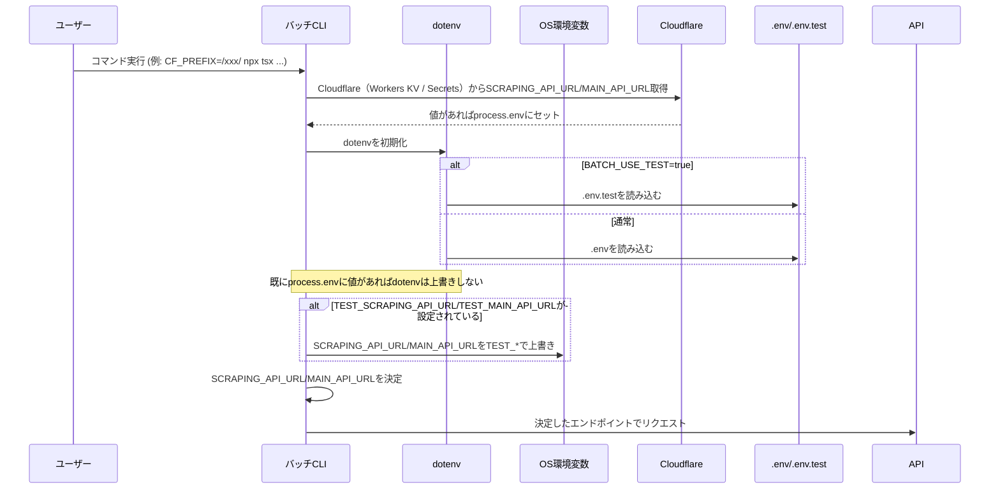

# Batch 実行ワークフロー

このファイルは、`packages/batch` の起動時にどの環境（local/.env / test/.env.test / 明示的な環境変数）からスクレイピングAPIおよびメインAPIのエンドポイントが決定されるかを示します。

# バッチ実行（環境選択）シーケンス図

このドキュメントは、`packages/batch` を起動したときに「どの環境設定（ローカル / test / 明示的な環境変数）」が使われて、スクレイピングAPIおよびメインAPIのエンドポイントが決定されるかを、シーケンス図で直感的に説明します。

---

わかりやすい補足（日本語）:

- 優先順位（高 → 低）:
  1. コマンド実行時に明示的に設定した環境変数（例: `SCRAPING_API_URL=https://... npx tsx ...`）
  2. `BATCH_USE_TEST=true` を付けている場合は `.env.test` を読み込み、その上で `TEST_SCRAPING_API_URL` / `TEST_MAIN_API_URL` があればそれらで上書き
  3. 上記がなければ `.env`（ローカル設定）または既存のプロセス環境変数を使用

- 具体例:
  - 普通にローカル開発: `.env` の `SCRAPING_API_URL=http://localhost:8788` を使用
  - テスト環境を使う: `BATCH_USE_TEST=true` を付け、`.env.test` にテストの URL を書く、または `TEST_` プレフィックスで指定
  - 一時的に別の URL を使いたい: コマンド実行時に明示的に `SCRAPING_API_URL` を渡す

- 注意:
  - `.env` / `.env.test` のどちらもリポジトリに機密情報をコミットしないでください。
  - `TEST_*` 変数は `BATCH_USE_TEST=true` のときにのみ `SCRAPING_API_URL` / `MAIN_API_URL` に反映されます。

この説明で不明点があれば、どのケースで使いたいか教えてください。さらに図に具体的なコマンド例を追加できます。

わかりやすい補足（日本語）:

- 優先順位（高 → 低）:
  1. コマンド実行時に明示的に設定した環境変数（例: `SCRAPING_API_URL=https://... npx tsx ...`）
  2. `BATCH_USE_TEST=true` を付けている場合は `.env.test` を読み込み、その上で `TEST_SCRAPING_API_URL` / `TEST_MAIN_API_URL` があればそれらで上書き
  3. 上記がなければ `.env`（ローカル設定）または既存のプロセス環境変数を使用

- 具体例:
  - 普通にローカル開発: `.env` の `SCRAPING_API_URL=http://localhost:8788` を使用
  - テスト環境を使う: `BATCH_USE_TEST=true` を付け、`.env.test` にテストの URL を書く、または `TEST_` プレフィックスで指定
  - 一時的に別の URL を使いたい: コマンド実行時に明示的に `SCRAPING_API_URL` を渡す

- 注意:
  - `.env` / `.env.test` のどちらもリポジトリに機密情報をコミットしないでください。
  - `TEST_*` 変数は `BATCH_USE_TEST=true` のときにのみ `SCRAPING_API_URL` / `MAIN_API_URL` に反映されます。

この説明で不明点があれば、どのケースで使いたいか教えてください。さらに図に具体的なコマンド例を追加できます。
