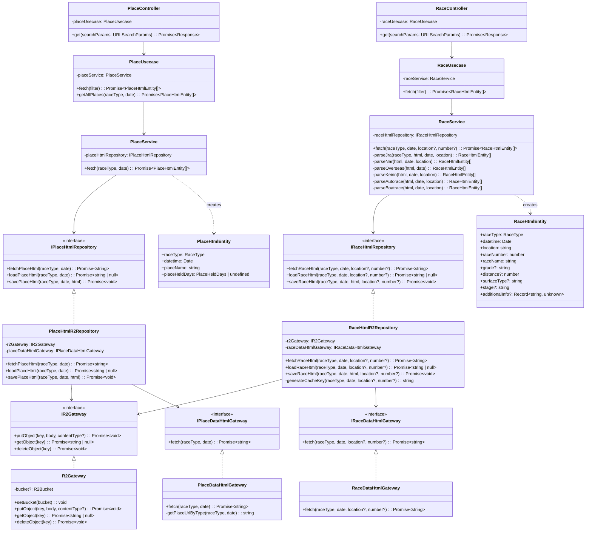

# Scraping パッケージ クラス図

このドキュメントは scraping パッケージのクラス構造を記述したものです。

## アーキテクチャ概要

scraping パッケージは、レース情報や開催場情報をWebからスクレイピングし、R2ストレージにキャッシュするためのモジュールです。
レイヤードアーキテクチャを採用し、以下の層で構成されています：

- **Controller層**: HTTPリクエストを受け取り、レスポンスを返す
- **Usecase層**: ビジネスロジックを実行し、複数のServiceを統合
- **Service層**: 特定のドメイン（Place/Race）のスクレイピング処理を実行
- **Repository層**: データの保存・読み込みを担当（R2キャッシュ）
- **Gateway層**: 外部システム（Webサイト、R2）とのインタフェース
- **Entity層**: データ構造の定義

## クラス図

## 各層の責務

### Controller層

- HTTPリクエストのパラメータを解析
- バリデーション
- Usecaseの呼び出し
- レスポンスのフォーマット

### Usecase層

- 複数のServiceを統合して処理を実行
- 日付範囲のループ処理
- 複数のレースタイプの統合処理

### Service層

- HTMLの取得とパース処理
- レースタイプごとの専用パース処理
- Entityの生成

### Repository層

- R2キャッシュからのHTML読み込み
- R2キャッシュへのHTML保存
- Webからの新規HTML取得

### Gateway層

- 外部WebサイトからのHTML取得
- R2ストレージへの読み書き

### Entity層

- スクレイピングで取得したデータの型定義

## 依存性注入

依存性注入は tsyringe を使用しています。
各クラスは `@injectable()` デコレータでマークされ、
コンストラクタで `@inject('InterfaceName')` により依存を注入します。

DI登録は [di.ts](../src/di.ts) で行われています。
