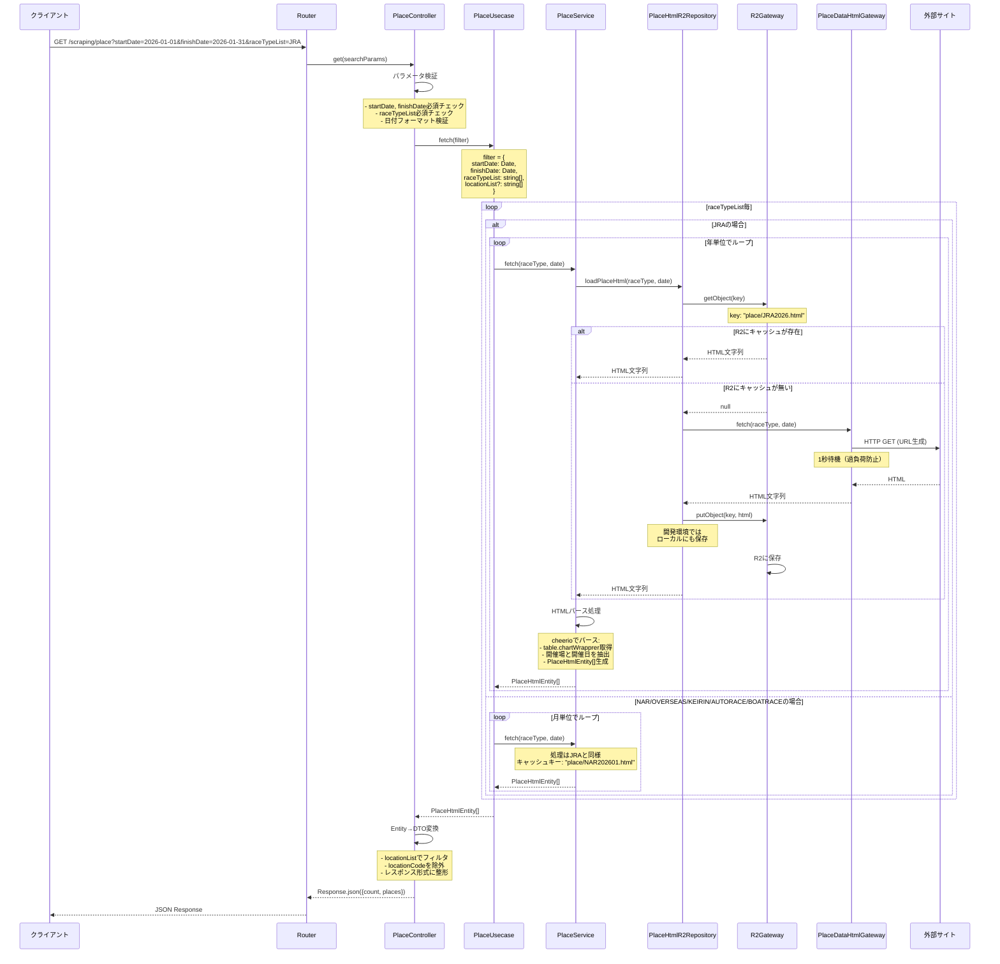
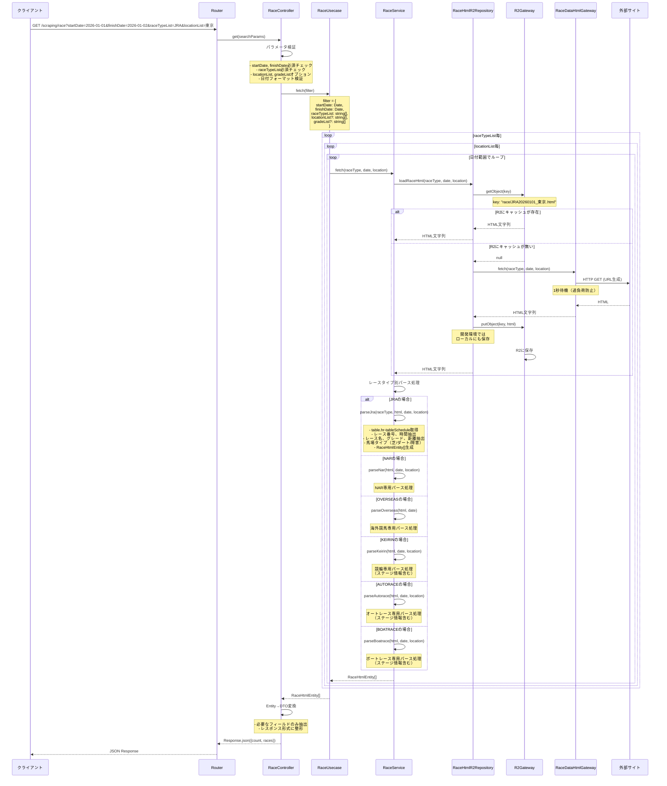

# Scraping パッケージ シーケンス図

## Place取得のシーケンス図

## Race取得のシーケンス図

## データフロー

### Place取得のデータフロー
1. クライアントが日付範囲とraceTypeListを指定してリクエスト
2. Controllerがパラメータを検証し、Usecaseに処理を委譲
3. Usecaseがレースタイプごと、期間ごとにServiceを呼び出し
4. ServiceがRepositoryを通じてHTMLを取得（R2キャッシュ or Web）
5. ServiceがHTMLをパースしてPlaceHtmlEntityを生成
6. ControllerがEntityをDTOに変換してJSONレスポンスを返却

### Race取得のデータフロー
1. クライアントが日付範囲、raceTypeList、locationListを指定してリクエスト
2. Controllerがパラメータを検証し、Usecaseに処理を委譲
3. Usecaseがレースタイプごと、開催場ごと、日付ごとにServiceを呼び出し
4. ServiceがRepositoryを通じてHTMLを取得（R2キャッシュ or Web）
5. Serviceがレースタイプに応じた専用パース処理を実行
6. ServiceがRaceHtmlEntityを生成
7. ControllerがEntityをDTOに変換してJSONレスポンスを返却

## キャッシュ戦略

### R2キャッシュのキー設計

**Place HTML**
- JRA: `place/JRA{year}.html` (例: `place/JRA2026.html`)
- その他: `place/{raceType}{yyyyMM}.html` (例: `place/NAR202601.html`)

**Race HTML**
- 基本形式: `race/{raceType}{yyyyMMdd}_{location}.html` (例: `race/JRA20260101_東京.html`)
- レース番号指定時: `race/{raceType}{yyyyMMdd}_{location}_R{number}.html`

### ローカル開発環境
- `NODE_ENV=development` の場合、R2への保存と並行してローカルにもHTMLを保存
- ローカル保存先: `packages/scraping/.wrangler/` (packages/scraping/local_html/)

## エラーハンドリング

### Controller層
- パラメータ不足時: 400エラー
- 日付フォーマット不正時: 400エラー
- 内部エラー時: 500エラー

### Service層
- HTML取得失敗時: エラーログを出力し、空配列を返却（処理継続）
- パース失敗時: console.warnでログ出力

### Gateway層
- fetch失敗時: エラーをthrow
- R2接続失敗時: nullを返却（キャッシュなしとして処理）
